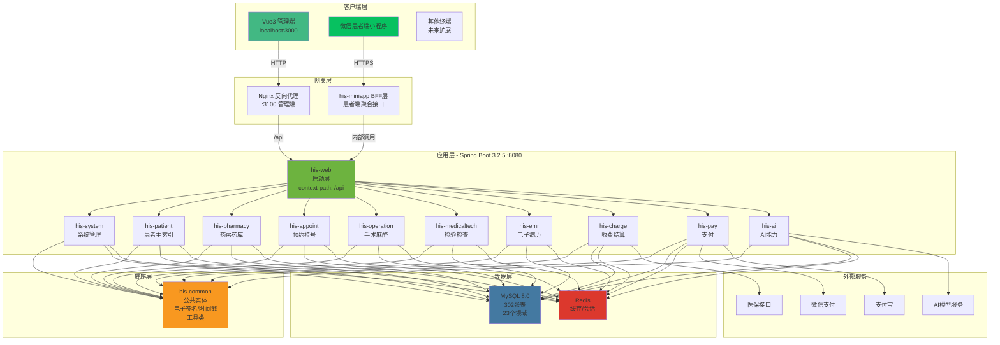
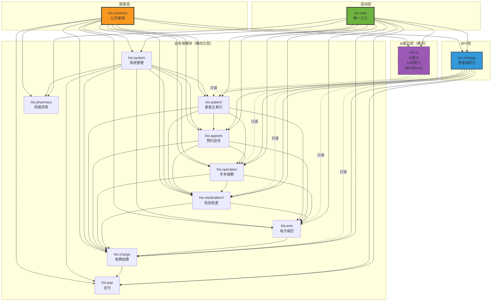
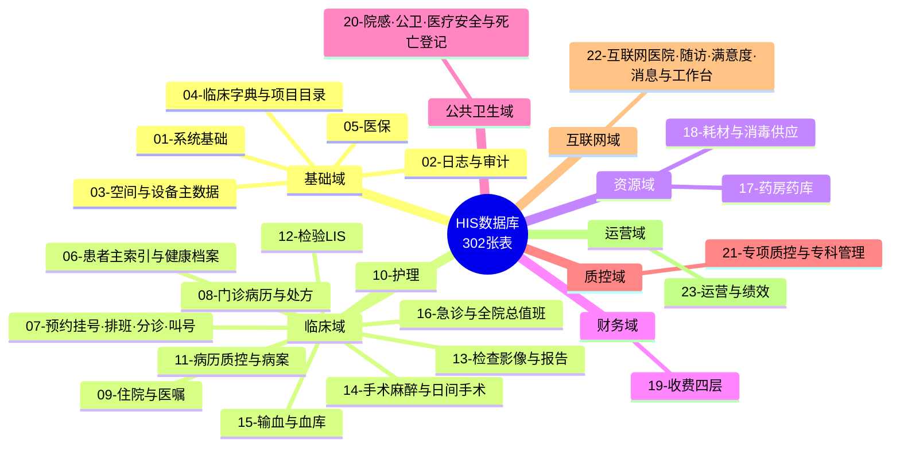
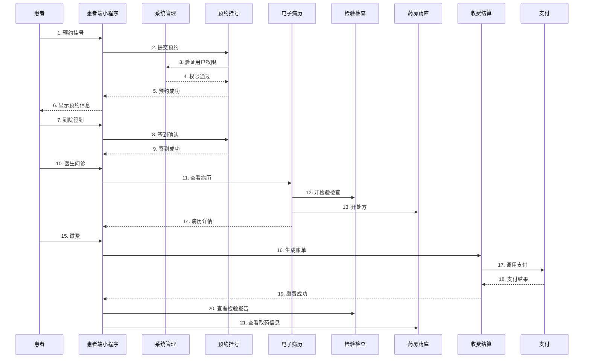
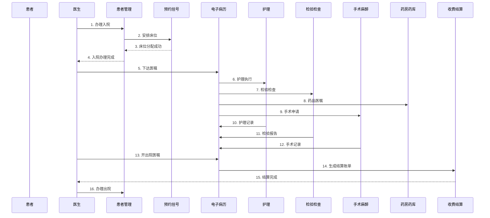
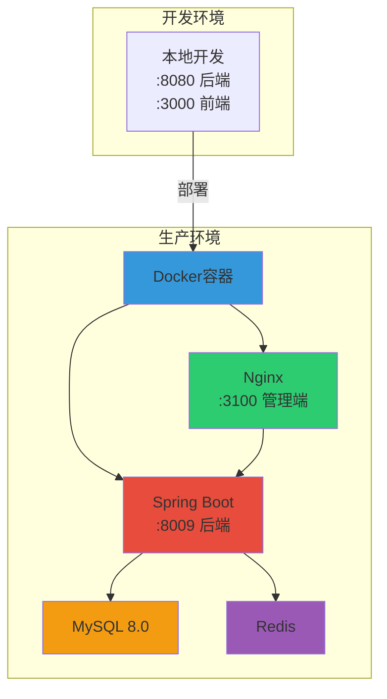

# CSLK-HIS 系统整体架构图

## 一、系统分层架构



## 二、模块依赖关系



## 三、技术栈总览

### 3.1 后端技术栈

| 层级 | 技术 | 版本 | 说明 |
|------|------|------|------|
| 运行时 | Java | 21 | LTS版本 |
| 框架 | Spring Boot | 3.2.5 | 核心框架 |
| ORM | MyBatis-Plus | 3.5.6 | 持久层框架 |
| 数据库 | MySQL | 8.0+ | 关系型数据库 |
| 缓存 | Redis | - | 缓存/会话 |
| 认证 | JWT (jjwt) | 0.12.5 | 令牌认证 |
| 文档 | Knife4j | 4.4.0 | OpenAPI 3.0 |
| 工具 | Hutool | 5.8.26 | Java工具库 |
| PDF | OpenPDF | 1.3.30 | PDF生成 |
| 二维码 | ZXing | 3.5.3 | 条码生成 |
| 支付 | 微信支付SDK | 4.6.0 | wx-java-pay |
| 支付 | 支付宝SDK | 4.38.0.ALL | alipay-sdk-java |

### 3.2 前端技术栈

| 层级 | 技术 | 版本 | 说明 |
|------|------|------|------|
| 框架 | Vue | 3.5 | 渐进式框架 |
| 构建工具 | Vite | 8 | 开发服务器 |
| UI组件 | Element Plus | 2.14.5 | 组件库 |
| 样式 | Tailwind CSS | 4.3.3 | 原子化CSS |
| 状态管理 | Pinia | 4.0.3 | 状态管理 |
| 路由 | Vue Router | 5.3.1 | 路由管理 |
| HTTP | Axios | 1.7.0 | HTTP客户端 |
| 工具 | @vueuse/core | 14.4.0 | 组合式工具集 |
| 加密 | sm-crypto | 0.5.7 | 国密算法 |

### 3.3 患者端技术栈

| 技术 | 说明 |
|------|------|
| 微信小程序原生框架 | 患者端小程序 |

### 3.4 部署技术栈

| 技术 | 说明 |
|------|------|
| Docker Compose | 容器编排 |
| Nginx | 反向代理 |

## 四、数据库领域划分



## 五、核心业务流程

### 5.1 门诊就诊流程



### 5.2 住院就诊流程



## 六、安全架构

```mermaid
graph TB
    subgraph "认证层"
        A1[JWT令牌]
        A2[登录态管理]
    end

    subgraph "授权层"
        B1[菜单权限]
        B2[按钮权限]
        B3[数据权限]
    end

    subgraph "防护层"
        C1[参数校验<br/>@NotBlank/@NotNull]
        C2[SQL注入防护<br/>MyBatis-Plus预编译]
        C3[XSS防护]
        C4[CSRF防护]
    end

    subgraph "审计层"
        D1[操作日志]
        D2[数据变更审计]
    end

    subgraph "签名层"
        E1[电子签名]
        E2[TSA时间戳]
    end

    A1 --> B1
    A1 --> B2
    A1 --> B3
    B1 --> C1
    B2 --> C1
    B3 --> C1
    C1 --> D1
    C2 --> D1
    C3 --> D1
    C4 --> D1
    D1 --> E1
    D2 --> E2

    style A1 fill:#e74c3c
    style B1 fill:#f39c12
    style C1 fill:#3498db
    style D1 fill:#9b59b6
    style E1 fill:#2ecc71
```

## 七、部署架构



## 八、接口规范

### 8.1 RESTful规范

| HTTP方法 | 用途 | URL命名示例 |
|----------|------|-------------|
| GET | 获取资源 | getById, getDetailById, listPage, selectList, selectListPage |
| POST | 创建/复杂查询 | xxxUpsert |
| DELETE | 删除资源 | deleteById |

### 8.2 数据传输规范

| 类型 | 命名规则 | 示例 |
|------|----------|------|
| 入参DTO | xxxDTO, xxxUpsertDTO, xxxQueryPageDTO, xxxQueryDTO | UserUpsertDTO, UserQueryPageDTO |
| 出参VO | xxxVO, listVO, detailVO, SelectListVO | UserVO, UserListVO, UserDetailVO, UserSelectListVO |

### 8.3 统一响应结构

```json
{
  "code": 200,
  "message": "success",
  "data": {}
}
```

## 九、开发规范要点

1. **模块化单体 + 单向分层**：his-common底座 → 业务域 → his-ai → his-miniapp → his-web
2. **跨模块依赖**：只依赖对方Service，禁止直连Mapper
3. **主键处理**：入参Long，出参String序列化（ToStringSerializer）
4. **日期格式**：LocalDateTime用yyyy-MM-dd HH:mm:ss，LocalDate用yyyy-MM-dd
5. **唯一键删除**：物理删purgeXxx，软删会占唯一键
6. **前端复用**：优先使用src/components/his/已有组件
7. **弹层样式**：必须写全局src/style.css，禁用scoped :deep
8. **分页配置**：统一使用src/lib/pagination.js的PAGE_SIZES和DEFAULT_PAGE_SIZE
9. **表注释**：只写"是什么"，禁止写举例、跨表引用、口径说明
10. **枚举使用**：能做成枚举的直接做成枚举，能存Redis的存Redis

## 十、文档索引

| 文档 | 路径 |
|------|------|
| 用户需求说明书 | docs/00-开发文档/用户需求说明书.docx |
| 需求规格说明书 | docs/00-开发文档/需求规格说明书.doc |
| 概要设计说明书 | docs/00-开发文档/概要设计说明书.docx |
| 详细设计说明书 | docs/00-开发文档/详细设计说明书.docx |
| 业务架构设计说明书 | docs/00-开发文档/业务架构设计说明书.docx |
| 测试账号与凭据 | docs/00-开发文档/测试账号与凭据.md |
| 初始化DDL | docs/01-初始化DDL/（23个领域） |
| 铺底基础数据 | docs/02-铺底基础数据/ |
| 增量SQL变更 | docs/03-增量SQL变更/ |
| ER关系图 | docs/10-ER关系图/ |
