# cslk_his 分域 E-R 图（Mermaid）

> 由 `workspace/_er/emit.mjs` 生成。实体 = 表；连线 = 通过数据覆盖率验证的 `*_id` 外键。
> 实体名写作 `中文名 · 表名`（Mermaid 实体别名，10.5+ / GitHub 可渲染）；属性行是 `类型 列名 "列中文注释"`。
> `A ||--o{ B : col` = A 一条对应 B 多条；`||--|{` 表示子表该列 NOT NULL；`||--||` 表示子表该列唯一（1:1）。
> 每张图只画「本域表 + 被引用到的上游表（只带主键与外键列）」，属性省略非键列。
> 要交互浏览（缩放、按表看邻居、只看有数据证据的关系）用 `docs/er/index.html`。

## 01 系统基础（组织·用户·岗位·权限·参数·字典）

```mermaid
erDiagram
  sys_department["科室 · sys_department"] {
    bigint id "主键ID"
    varchar dept_code "科室编码（唯一）"
    bigint parent_id "父科室ID"
  }
  sys_role["角色 · sys_role"] {
    bigint id "主键ID"
    varchar role_code "角色编码（唯一）"
  }
  sys_menu["菜单 · sys_menu"] {
    bigint id "主键ID"
    bigint parent_id "父菜单ID"
    varchar menu_key "菜单标识（唯一）"
  }
  sys_role_menu["角色菜单关联 · sys_role_menu"] {
    bigint id "主键ID"
    bigint role_id "角色ID"
    bigint menu_id "菜单ID"
  }
  sys_user["用户 · sys_user"] {
    bigint id "主键ID"
    varchar user_name "用户名（唯一）"
    bigint emp_id "关联员工ID"
    bigint patient_id "关联患者ID"
    varchar openid "微信openid"
  }
  sys_employee["员工 · sys_employee"] {
    bigint id "主键ID"
    varchar emp_code "员工编号（唯一）"
    bigint dept_id "科室ID"
  }
  sys_employee_post["员工岗位（角色×科室） · sys_employee_post"] {
    bigint id "主键ID"
    bigint employee_id "用户ID"
    bigint role_id "角色ID"
    bigint dept_id "科室ID"
  }
  sys_employee_qualification["员工资格证书 · sys_employee_qualification"] {
    bigint id "主键（雪花ID）"
    bigint employee_id "员工ID"
    varchar cert_type "证书类型（2-医师执业证 3-护士执业证 4-药师资格证 5-技术职称聘书 9-其他）"
    varchar cert_no "证书编号"
  }
  sys_employee_tech_auth["医疗技术授权台账 · sys_employee_tech_auth"] {
    bigint id "主键（雪花ID）"
    bigint employee_id "员工ID"
    bigint dept_id "所属科室ID"
    tinyint auth_category "授权类别（1-手术 2-麻醉 3-内镜与介入）"
    date valid_from "授权生效日期"
    bigint approver_id "审批人"
  }
  biz_tech_auth_override["越权授权事后登记 · biz_tech_auth_override"] {
    bigint id "主键（雪花ID）"
    bigint employee_id "越权操作者（员工ID）"
    bigint supervisor_id "上级确认人（员工ID）"
  }
  sys_config["系统参数 · sys_config"] {
    bigint config_id "配置ID"
    varchar config_key "配置键"
  }
  sys_dict_type["字典类型 · sys_dict_type"] {
    bigint id "主键ID"
    varchar dict_type "字典类型（唯一）"
  }
  sys_dict_data["字典数据 · sys_dict_data"] {
    bigint id "主键ID"
  }
  sys_attachment["附件 · sys_attachment"] {
    bigint attachment_id "附件ID"
    bigint upload_user_id "上传人ID"
  }
  sys_sign_cert["电子签名证书 · sys_sign_cert"] {
    bigint id "主键ID"
    varchar cert_no "证书编号"
    bigint emp_id "签名人员工ID"
    bigint dept_id "所属科室ID"
    bigint revoke_by "吊销操作人员工ID"
  }
  sys_tsa_server["时间戳服务注册 · sys_tsa_server"] {
    bigint id "主键ID"
    varchar tsa_code "TSA服务编码"
  }
  sys_field_change_log["字段级修改日志 · sys_field_change_log"] {
    bigint id "主键ID"
    bigint operator_id "操作人ID"
    bigint dept_id "操作人科室ID"
  }
  biz_patient["患者基本信息 · biz_patient"] {
    bigint id "主键ID"
  }
  sys_employee ||--|{ biz_tech_auth_override : "employee_id"
  sys_employee ||--o{ biz_tech_auth_override : "supervisor_id"
  sys_user ||--o{ sys_attachment : "upload_user_id"
  sys_department ||--|{ sys_department : "parent_id"
  sys_department ||--o{ sys_employee : "dept_id"
  sys_employee ||--|{ sys_employee_post : "employee_id"
  sys_role ||--|{ sys_employee_post : "role_id"
  sys_department ||--|{ sys_employee_post : "dept_id"
  sys_employee ||--|{ sys_employee_qualification : "employee_id"
  sys_employee ||--|{ sys_employee_tech_auth : "employee_id"
  sys_department ||--o{ sys_employee_tech_auth : "dept_id"
  sys_employee ||--o{ sys_employee_tech_auth : "approver_id"
  sys_employee ||--o{ sys_field_change_log : "operator_id"
  sys_department ||--o{ sys_field_change_log : "dept_id"
  sys_menu ||--o{ sys_menu : "parent_id"
  sys_role ||--|{ sys_role_menu : "role_id"
  sys_menu ||--|{ sys_role_menu : "menu_id"
  sys_employee ||--|{ sys_sign_cert : "emp_id"
  sys_department ||--o{ sys_sign_cert : "dept_id"
  sys_employee ||--o{ sys_sign_cert : "revoke_by"
  sys_employee ||--o{ sys_user : "emp_id"
  biz_patient ||--o{ sys_user : "patient_id"
```

## 02 日志与审计

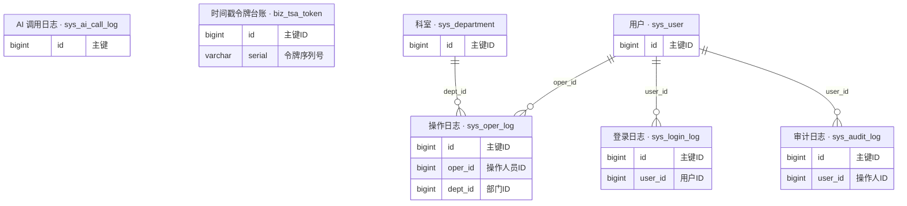

## 03 空间与设备主数据（病区·床位·诊室·手术间·设备）

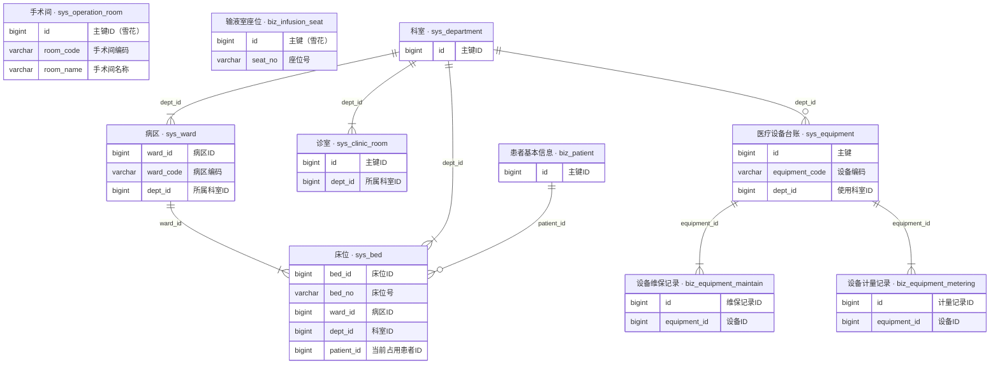

## 04 临床字典与项目目录（药品·耗材·诊疗项目·诊断编码）

```mermaid
erDiagram
  sys_drug["药品字典 · sys_drug"] {
    bigint id "主键ID"
    varchar drug_code "药品编码（唯一）"
  }
  sys_drug_price_history["药品价格变动史 · sys_drug_price_history"] {
    bigint history_id "历史记录ID"
    bigint drug_id "药品ID"
    bigint operator_id "操作人ID"
  }
  sys_price_change_history["项目价格变更史 · sys_price_change_history"] {
    bigint id "主键ID（雪花）"
    bigint operator_id "操作人ID（员工ID）"
  }
  sys_consumable["耗材字典 · sys_consumable"] {
    bigint id "主键ID"
    varchar consumable_code "耗材编码（唯一）"
  }
  sys_inspection_item["检查项目字典 · sys_inspection_item"] {
    bigint id "主键ID"
    varchar item_code "项目编码（唯一）"
    bigint dept_id "检查科室ID"
  }
  sys_laboratory_item["检验项目字典 · sys_laboratory_item"] {
    bigint id "主键ID"
    varchar item_code "项目编码（唯一）"
    bigint dept_id "检验科室ID"
  }
  sys_laboratory_item_detail["检验项目组套明细 · sys_laboratory_item_detail"] {
    bigint id "主键ID"
    bigint laboratory_item_id "检验大项目ID"
  }
  sys_treatment_item["治疗项目字典 · sys_treatment_item"] {
    bigint id "主键ID"
    varchar item_code "项目编码（唯一）"
    bigint dept_id "执行科室ID"
  }
  sys_diagnosis["诊断字典 · sys_diagnosis"] {
    bigint id "主键ID"
    varchar diagnosis_code "诊断编码"
    bigint parent_id "父诊断ID"
  }
  sys_icd10["ICD-10 诊断编码 · sys_icd10"] {
    bigint id "主键ID"
  }
  sys_icd9cm3["ICD-9-CM-3 手术编码 · sys_icd9cm3"] {
    bigint id "主键"
    varchar op_code "手术操作编码"
  }
  sys_supplier["供应商 · sys_supplier"] {
    bigint supplier_id "供应商ID"
    varchar supplier_code "供应商编码"
  }
  sys_patient_tag["患者标签 · sys_patient_tag"] {
    bigint tag_id "标签ID"
  }
  sys_infectious_disease["法定传染病目录 · sys_infectious_disease"] {
    bigint id "主键"
    varchar disease_code "病种编码"
  }
  sys_single_disease["单病种质控目录 · sys_single_disease"] {
    bigint id "主键（雪花）"
    varchar disease_code "病种编码"
  }
  sys_drg_group["DRG 分组与权重 · sys_drg_group"] {
    bigint id "主键ID"
    varchar drg_code "DRG 组编码"
    tinyint del_flag "删除标志（0-正常 1-删除）"
  }
  sys_checkup_package["体检套餐 · sys_checkup_package"] {
    bigint id "主键ID"
    varchar package_name "套餐名称"
  }
  sys_checkup_package_item["体检套餐项目 · sys_checkup_package_item"] {
    bigint id "主键ID"
    bigint package_id "套餐ID"
  }
  biz_shift["班次字典 · biz_shift"] {
    bigint id "主键ID"
    bigint dept_id "适用科室ID"
  }
  sys_drug_interaction["药物相互作用知识库 · sys_drug_interaction"] {
    bigint id "主键"
    varchar pair_key "成分对归一化键"
  }
  sys_drug_dose_limit["药品剂量上限知识库 · sys_drug_dose_limit"] {
    bigint id "主键"
    varchar component "成分关键字"
  }
  sys_department["科室 · sys_department"] {
    bigint id "主键ID"
  }
  sys_employee["员工 · sys_employee"] {
    bigint id "主键ID"
  }
  sys_department ||--o{ biz_shift : "dept_id"
  sys_checkup_package ||--|{ sys_checkup_package_item : "package_id"
  sys_diagnosis ||--o{ sys_diagnosis : "parent_id"
  sys_drug ||--|{ sys_drug_price_history : "drug_id"
  sys_employee ||--o{ sys_drug_price_history : "operator_id"
  sys_department ||--o{ sys_inspection_item : "dept_id"
  sys_department ||--o{ sys_laboratory_item : "dept_id"
  sys_laboratory_item ||--|{ sys_laboratory_item_detail : "laboratory_item_id"
  sys_employee ||--o{ sys_price_change_history : "operator_id"
  sys_department ||--o{ sys_treatment_item : "dept_id"
```

## 05 医保（目录·对照·备案·结算·审核）

```mermaid
erDiagram
  biz_yb_catalog["国家医保目录 · biz_yb_catalog"] {
    bigint id "主键（雪花）"
    varchar yb_code "国家医保编码"
  }
  biz_yb_mapping["医保目录对照 · biz_yb_mapping"] {
    bigint id "主键（雪花）"
    tinyint item_type "院内项目类型（1-药品 2-诊疗项目 3-检验项目 4-耗材）"
    bigint item_id "院内项目ID"
    bigint catalog_id "医保目录ID"
  }
  biz_yb_chronic_catalog["门诊慢特病病种目录 · biz_yb_chronic_catalog"] {
    bigint id "主键"
    varchar disease_code "病种编码"
  }
  biz_yb_chronic_reg["门诊慢特病备案 · biz_yb_chronic_reg"] {
    bigint id "主键"
    varchar reg_no "备案单号"
    bigint patient_id "患者ID"
    bigint catalog_id "病种目录ID"
    varchar disease_code "病种编码快照"
    bigint certify_dept_id "诊断科室ID"
    bigint register_dept_id "备案经办机构ID"
    bigint register_emp_id "备案经办人ID"
    date valid_end_key "唯一键辅助列 = COALESCE"
    tinyint reg_status "状态（1-有效 2-已注销 3-已驳回）"
  }
  biz_yb_deduct_notice["医保扣款通知单 · biz_yb_deduct_notice"] {
    bigint id "主键"
    varchar deduct_no "扣款单号"
    bigint inspection_id "关联飞检批次ID"
    bigint settlement_id "关联医保结算清单ID（可选）"
    bigint patient_id "患者ID"
    bigint dept_id "被审科室ID"
    bigint liable_dept_id "责任科室ID"
  }
  biz_yb_deduct_log["医保扣款处理留痕 · biz_yb_deduct_log"] {
    bigint id "自增主键"
    bigint notice_id "扣款通知ID"
  }
  biz_yb_inspection["医保飞检批次 · biz_yb_inspection"] {
    bigint id "主键（雪花ID）"
    varchar inspect_no "批次号"
  }
  sys_insurance_policy["医保政策配置 · sys_insurance_policy"] {
    bigint id "主键ID"
  }
  biz_insurance_catalog_rule["医保目录报销规则 · biz_insurance_catalog_rule"] {
    bigint id "主键（雪花）"
    varchar rule_no "规则编号"
    varchar item_code "项目编码"
    tinyint catalog_type "医保目录类别（0-自费 1-甲类 2-乙类 3-丙类）"
    tinyint encounter_type "就诊类型（1-门诊 2-住院）"
    varchar insurance_type "医保类型（职工/居民/公费等；NULL=通用规则，所有医保类型共用）"
    date effective_date "生效日期（含）"
  }
  biz_insurance_settlement["医保结算清单 · biz_insurance_settlement"] {
    bigint id "主键ID"
    varchar settlement_no "结算清单号"
    bigint bill_id "结算账单ID"
    bigint patient_id "患者ID"
    bigint regist_id "挂号ID快照"
    bigint dept_id "科室ID"
    bigint doctor_id "医生ID"
  }
  biz_settlement_diagnosis["结算清单诊断明细 · biz_settlement_diagnosis"] {
    bigint id "主键ID"
    bigint settlement_id "结算清单ID"
  }
  biz_settlement_operation["结算清单手术明细 · biz_settlement_operation"] {
    bigint id "主键ID"
    bigint settlement_id "结算清单ID"
  }
  biz_insurance_report["医保报盘报文台账 · biz_insurance_report"] {
    bigint id "主键（雪花）"
    bigint settlement_id "医保结算清单ID"
    varchar trade_no "HIS 侧流水号"
  }
  biz_compliance_audit["医保合规审核单 · biz_compliance_audit"] {
    bigint id "主键ID"
    varchar audit_no "审核单号"
    bigint settlement_id "结算清单ID"
    bigint regist_id "就诊锚点"
  }
  biz_compliance_audit_item["医保合规审核明细 · biz_compliance_audit_item"] {
    bigint id "主键ID"
    bigint audit_id "审核ID"
  }
  biz_appoint_info["挂号信息 · biz_appoint_info"] {
    bigint id "主键ID"
  }
  biz_patient["患者基本信息 · biz_patient"] {
    bigint id "主键ID"
  }
  biz_settlement_bill["结算账单 · biz_settlement_bill"] {
    bigint id "主键（雪花）"
  }
  sys_department["科室 · sys_department"] {
    bigint id "主键ID"
  }
  sys_employee["员工 · sys_employee"] {
    bigint id "主键ID"
  }
  biz_insurance_settlement ||--|{ biz_compliance_audit : "settlement_id"
  biz_appoint_info ||--o{ biz_compliance_audit : "regist_id"
  biz_compliance_audit ||--|{ biz_compliance_audit_item : "audit_id"
  biz_insurance_settlement ||--|{ biz_insurance_report : "settlement_id"
  biz_settlement_bill ||--|| biz_insurance_settlement : "bill_id"
  biz_patient ||--|{ biz_insurance_settlement : "patient_id"
  biz_appoint_info ||--o{ biz_insurance_settlement : "regist_id"
  sys_department ||--o{ biz_insurance_settlement : "dept_id"
  sys_employee ||--o{ biz_insurance_settlement : "doctor_id"
  biz_insurance_settlement ||--|{ biz_settlement_diagnosis : "settlement_id"
  biz_insurance_settlement ||--|{ biz_settlement_operation : "settlement_id"
  biz_patient ||--|{ biz_yb_chronic_reg : "patient_id"
  biz_yb_chronic_catalog ||--|{ biz_yb_chronic_reg : "catalog_id"
  sys_department ||--o{ biz_yb_chronic_reg : "certify_dept_id"
  sys_department ||--o{ biz_yb_chronic_reg : "register_dept_id"
  sys_employee ||--o{ biz_yb_chronic_reg : "register_emp_id"
  biz_yb_deduct_notice ||--|{ biz_yb_deduct_log : "notice_id"
  biz_yb_inspection ||--o{ biz_yb_deduct_notice : "inspection_id"
  biz_insurance_settlement ||--o{ biz_yb_deduct_notice : "settlement_id"
  biz_patient ||--o{ biz_yb_deduct_notice : "patient_id"
  sys_department ||--o{ biz_yb_deduct_notice : "dept_id"
  sys_department ||--o{ biz_yb_deduct_notice : "liable_dept_id"
  biz_yb_catalog ||--|{ biz_yb_mapping : "catalog_id"
```

## 06 患者主索引与健康档案

```mermaid
erDiagram
  biz_patient["患者基本信息 · biz_patient"] {
    bigint id "主键ID"
    varchar patient_no "患者号"
    bigint master_id "主索引"
    bigint last_visit_dept "最后就诊科室"
    bigint last_visit_doctor "最后就诊医生"
    bigint first_visit_dept_id "首次就诊科室ID"
    bigint first_visit_doctor_id "首次接诊医生ID"
  }
  biz_patient_contact["患者联系方式 · biz_patient_contact"] {
    bigint id "主键ID"
    bigint patient_id "患者ID"
  }
  biz_patient_allergy["药物过敏史 · biz_patient_allergy"] {
    bigint id "主键ID"
    bigint patient_id "患者ID"
  }
  biz_patient_past_disease["既往疾病史 · biz_patient_past_disease"] {
    bigint id "主键ID"
    bigint patient_id "患者ID"
  }
  biz_patient_family_history["家族史 · biz_patient_family_history"] {
    bigint id "主键ID"
    bigint patient_id "患者ID"
  }
  biz_patient_surgery_history["手术外伤史 · biz_patient_surgery_history"] {
    bigint id "主键ID"
    bigint patient_id "患者ID"
  }
  biz_patient_medication_history["既往用药史 · biz_patient_medication_history"] {
    bigint id "主键ID"
    bigint patient_id "患者ID"
  }
  biz_patient_tag_relation["患者标签关联 · biz_patient_tag_relation"] {
    bigint id "主键ID"
    bigint patient_id "患者ID"
    bigint tag_id "标签ID"
  }
  biz_patient_guardian["就诊人绑定 · biz_patient_guardian"] {
    bigint id "主键ID"
    bigint user_id "登录账号ID"
    bigint patient_id "就诊人ID"
  }
  biz_patient_merge_log["患者合并审计 · biz_patient_merge_log"] {
    bigint id "主键ID（雪花）"
    varchar merge_no "合并流水号"
    bigint master_id "主档患者ID"
    bigint merged_id "被并入的患者ID"
    bigint operator_id "操作人ID"
  }
  biz_visit["就诊次 · biz_visit"] {
    bigint visit_id "就诊次ID"
    varchar visit_no "就诊次编号"
    bigint patient_id "患者ID"
  }
  biz_chronic_record["慢病建档 · biz_chronic_record"] {
    bigint id "主键（雪花）"
    varchar record_no "档案编号"
    bigint patient_id "患者ID"
    bigint doctor_id "认定医生ID"
    bigint dept_id "认定科室ID"
  }
  sys_department["科室 · sys_department"] {
    bigint id "主键ID"
  }
  sys_employee["员工 · sys_employee"] {
    bigint id "主键ID"
  }
  sys_patient_tag["患者标签 · sys_patient_tag"] {
    bigint tag_id "标签ID"
  }
  sys_user["用户 · sys_user"] {
    bigint id "主键ID"
  }
  biz_patient ||--|{ biz_chronic_record : "patient_id"
  sys_employee ||--|{ biz_chronic_record : "doctor_id"
  sys_department ||--o{ biz_chronic_record : "dept_id"
  biz_patient ||--o{ biz_patient : "master_id"
  sys_department ||--o{ biz_patient : "last_visit_dept"
  sys_employee ||--o{ biz_patient : "last_visit_doctor"
  sys_department ||--o{ biz_patient : "first_visit_dept_id"
  sys_employee ||--o{ biz_patient : "first_visit_doctor_id"
  biz_patient ||--|{ biz_patient_allergy : "patient_id"
  biz_patient ||--|{ biz_patient_contact : "patient_id"
  biz_patient ||--|{ biz_patient_family_history : "patient_id"
  sys_user ||--|{ biz_patient_guardian : "user_id"
  biz_patient ||--|{ biz_patient_guardian : "patient_id"
  biz_patient ||--|{ biz_patient_medication_history : "patient_id"
  biz_patient ||--|{ biz_patient_merge_log : "master_id"
  biz_patient ||--|{ biz_patient_merge_log : "merged_id"
  sys_employee ||--o{ biz_patient_merge_log : "operator_id"
  biz_patient ||--|{ biz_patient_past_disease : "patient_id"
  biz_patient ||--|{ biz_patient_surgery_history : "patient_id"
  biz_patient ||--|{ biz_patient_tag_relation : "patient_id"
  sys_patient_tag ||--|{ biz_patient_tag_relation : "tag_id"
  biz_patient ||--|{ biz_visit : "patient_id"
```

## 07 预约挂号·排班·分诊·叫号

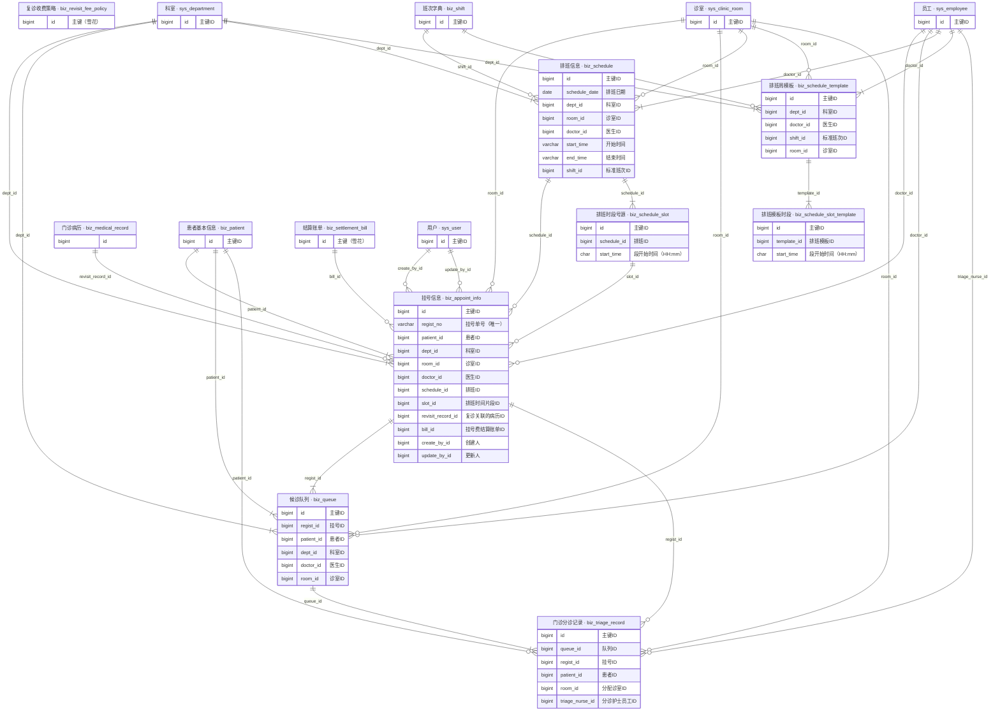

## 08 门诊病历与处方

```mermaid
erDiagram
  biz_medical_record["门诊病历 · biz_medical_record"] {
    bigint id
    varchar record_no "病历号"
    bigint patient_id "患者ID"
    bigint regist_id "挂号ID"
    bigint dept_id "科室ID"
    bigint doctor_id "医生ID"
    bigint sign_id "当前有效签名ID"
  }
  biz_medical_record_log["门诊病历修改日志 · biz_medical_record_log"] {
    bigint id "主键ID"
    bigint record_id "病历ID"
    bigint user_id "操作人ID"
  }
  biz_diag_template["常用诊断模板 · biz_diag_template"] {
    bigint id
    bigint doctor_id "医生ID"
  }
  biz_prescription["处方主表 · biz_prescription"] {
    bigint id
    varchar prescription_no "处方号"
    bigint patient_id "患者ID"
    bigint regist_id "挂号ID"
    bigint record_id "病历ID"
    bigint dept_id "科室ID"
    bigint doctor_id "医生ID"
    bigint doctor_sign_id "开方医师签名ID"
    bigint audit_sign_id "审方药师签名ID"
  }
  biz_prescription_detail["处方明细 · biz_prescription_detail"] {
    bigint id
    bigint prescription_id "处方ID"
    bigint drug_id "药品ID"
  }
  biz_rx_template["处方模板 · biz_rx_template"] {
    bigint id
    bigint doctor_id "医生ID"
  }
  biz_rx_template_detail["处方模板明细 · biz_rx_template_detail"] {
    bigint id
    bigint template_id "模板ID"
    bigint drug_id "药品ID"
  }
  biz_prescription_audit_log["处方审方流水 · biz_prescription_audit_log"] {
    bigint id
    bigint prescription_id "处方 id"
    bigint record_id "病历 id"
    bigint regist_id "挂号 id"
    bigint auditor_id "操作人员工 id"
  }
  biz_rx_flow["处方流转单 · biz_rx_flow"] {
    bigint id "主键（雪花）"
    varchar flow_no "流转单号"
    bigint prescription_id "处方ID"
    bigint patient_id "患者ID"
  }
  biz_rx_review_batch["处方点评批次 · biz_rx_review_batch"] {
    bigint id "主键"
    varchar batch_no "批次号"
    bigint reviewer_id "点评人员工ID"
  }
  biz_rx_review_item["处方点评明细 · biz_rx_review_item"] {
    bigint id "主键"
    bigint batch_id "批次ID"
    bigint prescription_id "处方ID"
    bigint doctor_id "开方医生ID"
    bigint reviewer_id "点评人员工ID"
  }
  biz_rx_doctor_talk["医师约谈记录 · biz_rx_doctor_talk"] {
    bigint id "主键"
    varchar talk_no "约谈编号"
    bigint doctor_id "被约谈医师ID"
  }
  biz_skin_test["门诊皮试记录 · biz_skin_test"] {
    bigint id "主键（雪花）"
    varchar test_no "皮试单号"
    bigint patient_id "患者ID"
    bigint treatment_record_id "来源治疗记录ID"
    bigint nurse_id "执行护士ID"
  }
  biz_tcm_decoct["中药代煎单 · biz_tcm_decoct"] {
    bigint id "主键ID（雪花）"
    bigint prescription_id "处方ID"
    bigint patient_id "患者ID"
    bigint pharmacy_id "代煎药房ID"
    bigint operator_id "最近一次状态操作人"
  }
  biz_narcotic_register["麻精药品专册 · biz_narcotic_register"] {
    bigint id "主键ID"
    varchar register_no "专册登记号"
    bigint prescription_id "处方ID"
    bigint dispensing_id "发药记录ID"
    bigint patient_id "患者ID"
    bigint dept_id "开方科室ID"
    bigint drug_id "药品ID"
    bigint doctor_id "开方医师ID"
    bigint dispense_by_id "发药人ID"
    bigint checker_id "复核人ID"
  }
  biz_outp_infusion["门诊输液单 · biz_outp_infusion"] {
    bigint id "主键（雪花）"
    varchar infusion_no "输液单号"
    bigint treatment_record_id "来源治疗记录ID"
    bigint patient_id "患者ID"
    bigint seat_id "座位ID"
    bigint skin_test_id "皮试记录ID"
    bigint nurse_id "责任护士ID"
  }
  biz_outp_infusion_round["门诊输液巡视记录 · biz_outp_infusion_round"] {
    bigint id "主键（雪花）"
    bigint infusion_id "输液单ID"
    bigint nurse_id "巡视护士ID"
  }
  biz_infusion_round["输液巡视记录 · biz_infusion_round"] {
    bigint id "主键ID（雪花）"
    bigint exec_id "执行行ID"
    bigint order_id "医嘱ID（冗余）"
    bigint admission_id "入院ID（冗余）"
    bigint round_nurse_id "巡视护士ID（员工ID）"
  }
  biz_admission["入院记录 · biz_admission"] {
    bigint admission_id "入院ID"
  }
  biz_appoint_info["挂号信息 · biz_appoint_info"] {
    bigint id "主键ID"
  }
  biz_drug_dispensing["药品发药记录 · biz_drug_dispensing"] {
    bigint id "主键ID"
  }
  biz_emr_signature["电子签名证据 · biz_emr_signature"] {
    bigint id "主键ID"
  }
  biz_infusion_seat["输液室座位 · biz_infusion_seat"] {
    bigint id "主键（雪花）"
  }
  biz_inpatient_order["住院医嘱主表 · biz_inpatient_order"] {
    bigint id "主键ID"
  }
  biz_inpatient_order_exec["医嘱执行记录 · biz_inpatient_order_exec"] {
    bigint id "主键ID"
  }
  biz_patient["患者基本信息 · biz_patient"] {
    bigint id "主键ID"
  }
  biz_treatment_record["治疗执行记录 · biz_treatment_record"] {
    bigint record_id "治疗记录ID"
  }
  sys_department["科室 · sys_department"] {
    bigint id "主键ID"
  }
  sys_drug["药品字典 · sys_drug"] {
    bigint id "主键ID"
  }
  sys_employee["员工 · sys_employee"] {
    bigint id "主键ID"
  }
  sys_user["用户 · sys_user"] {
    bigint id "主键ID"
  }
  sys_employee ||--|{ biz_diag_template : "doctor_id"
  biz_inpatient_order_exec ||--|{ biz_infusion_round : "exec_id"
  biz_inpatient_order ||--|{ biz_infusion_round : "order_id"
  biz_admission ||--|{ biz_infusion_round : "admission_id"
  sys_employee ||--o{ biz_infusion_round : "round_nurse_id"
  biz_patient ||--|{ biz_medical_record : "patient_id"
  biz_appoint_info ||--|{ biz_medical_record : "regist_id"
  sys_department ||--|{ biz_medical_record : "dept_id"
  sys_employee ||--|{ biz_medical_record : "doctor_id"
  biz_emr_signature ||--o{ biz_medical_record : "sign_id"
  biz_medical_record ||--|{ biz_medical_record_log : "record_id"
  sys_user ||--o{ biz_medical_record_log : "user_id"
  biz_prescription ||--o{ biz_narcotic_register : "prescription_id"
  biz_drug_dispensing ||--o{ biz_narcotic_register : "dispensing_id"
  biz_patient ||--o{ biz_narcotic_register : "patient_id"
  sys_department ||--o{ biz_narcotic_register : "dept_id"
  sys_drug ||--o{ biz_narcotic_register : "drug_id"
  sys_employee ||--o{ biz_narcotic_register : "doctor_id"
  sys_employee ||--o{ biz_narcotic_register : "dispense_by_id"
  sys_employee ||--o{ biz_narcotic_register : "checker_id"
  biz_treatment_record ||--o{ biz_outp_infusion : "treatment_record_id"
  biz_patient ||--|{ biz_outp_infusion : "patient_id"
  biz_infusion_seat ||--o{ biz_outp_infusion : "seat_id"
  biz_skin_test ||--o{ biz_outp_infusion : "skin_test_id"
  sys_employee ||--o{ biz_outp_infusion : "nurse_id"
  biz_outp_infusion ||--|{ biz_outp_infusion_round : "infusion_id"
  sys_employee ||--o{ biz_outp_infusion_round : "nurse_id"
  biz_patient ||--|{ biz_prescription : "patient_id"
  biz_appoint_info ||--|{ biz_prescription : "regist_id"
  biz_medical_record ||--o{ biz_prescription : "record_id"
  sys_department ||--|{ biz_prescription : "dept_id"
  sys_employee ||--|{ biz_prescription : "doctor_id"
  biz_emr_signature ||--o{ biz_prescription : "doctor_sign_id"
  biz_emr_signature ||--o{ biz_prescription : "audit_sign_id"
  biz_prescription ||--o{ biz_prescription_audit_log : "prescription_id"
  biz_medical_record ||--o{ biz_prescription_audit_log : "record_id"
  biz_appoint_info ||--o{ biz_prescription_audit_log : "regist_id"
  sys_employee ||--o{ biz_prescription_audit_log : "auditor_id"
  biz_prescription ||--|{ biz_prescription_detail : "prescription_id"
  sys_drug ||--|{ biz_prescription_detail : "drug_id"
  sys_employee ||--o{ biz_rx_doctor_talk : "doctor_id"
  biz_prescription ||--|{ biz_rx_flow : "prescription_id"
  biz_patient ||--|{ biz_rx_flow : "patient_id"
  sys_employee ||--o{ biz_rx_review_batch : "reviewer_id"
  biz_rx_review_batch ||--|{ biz_rx_review_item : "batch_id"
  biz_prescription ||--|{ biz_rx_review_item : "prescription_id"
  sys_employee ||--|{ biz_rx_review_item : "doctor_id"
  sys_employee ||--o{ biz_rx_review_item : "reviewer_id"
  sys_employee ||--|{ biz_rx_template : "doctor_id"
  biz_rx_template ||--|{ biz_rx_template_detail : "template_id"
  sys_drug ||--|{ biz_rx_template_detail : "drug_id"
  biz_patient ||--|{ biz_skin_test : "patient_id"
  biz_treatment_record ||--o{ biz_skin_test : "treatment_record_id"
  sys_employee ||--o{ biz_skin_test : "nurse_id"
  biz_prescription ||--|| biz_tcm_decoct : "prescription_id"
  biz_patient ||--|{ biz_tcm_decoct : "patient_id"
  sys_department ||--o{ biz_tcm_decoct : "pharmacy_id"
  sys_employee ||--o{ biz_tcm_decoct : "operator_id"
```

## 09 住院与医嘱（入出转·会诊·床位调度）

```mermaid
erDiagram
  biz_admission["入院记录 · biz_admission"] {
    bigint admission_id "入院ID"
    varchar admission_no "入院记录号"
    bigint patient_id "患者ID"
    bigint visit_id "就诊次ID"
    bigint regist_id "来源挂号ID"
    bigint admission_order_id "来源住院证ID"
    bigint admit_dept_id "入院科室ID"
    bigint dept_id "入院科室ID"
    bigint ward_id "病区ID"
    bigint bed_id "床位ID"
    bigint admit_doctor_id "入院医生ID"
  }
  biz_admission_order["入院通知单 · biz_admission_order"] {
    bigint id "主键ID"
    varchar order_no "住院证号"
    bigint patient_id "患者ID"
    bigint regist_id "来源挂号ID"
    bigint visit_id "来源就诊次ID"
    bigint source_dept_id "开证科室ID"
    bigint source_doctor_id "开证医生ID"
    bigint apply_dept_id "拟收治科室ID"
    bigint admission_id "收治后回填的入院ID"
    bigint admit_dept_id "实际收治科室ID"
  }
  biz_inpatient_order["住院医嘱主表 · biz_inpatient_order"] {
    bigint id "主键ID"
    bigint admission_id "入院ID"
    bigint patient_id "患者ID"
    bigint dept_id "开立科室ID"
    bigint ward_id "病区ID"
    bigint doctor_id "开立医生ID（员工ID）"
    bigint doctor_sign_id "开立医生签名ID"
    bigint verify_nurse_id "校对护士ID（员工ID）"
    bigint nurse_sign_id "校对护士签名ID"
    bigint stop_doctor_id "停止医嘱的医生ID"
  }
  biz_inpatient_order_exec["医嘱执行记录 · biz_inpatient_order_exec"] {
    bigint id "主键ID"
    bigint order_id "医嘱ID"
    bigint admission_id "入院ID"
    bigint patient_id "患者ID（冗余）"
    date plan_date "计划日期"
    bigint exec_nurse_id "执行护士ID（员工ID）"
    bigint fee_record_id "本次执行生成的记账行ID"
  }
  biz_inpatient_order_template["医嘱模板 · biz_inpatient_order_template"] {
    bigint id "模板ID（雪花）"
    bigint doctor_id "归属医生"
    bigint dept_id "创建时科室ID"
  }
  biz_inpatient_order_template_item["医嘱模板明细 · biz_inpatient_order_template_item"] {
    bigint id "明细ID（雪花）"
    bigint template_id "模板主表ID"
  }
  biz_inpatient_transfer["住院转科轨迹 · biz_inpatient_transfer"] {
    bigint id "转科记录ID（雪花）"
    bigint admission_id "入院ID"
    bigint patient_id "患者ID"
    bigint from_dept_id "转出科室ID"
    bigint from_ward_id "转出病区ID"
    bigint from_bed_id "转出床位ID"
    bigint to_dept_id "转入科室ID"
    bigint to_ward_id "转入病区ID"
    bigint to_bed_id "转入床位ID"
    bigint apply_doctor_id "转出方发起医生ID"
    bigint receive_doctor_id "转入方接收医生ID（员工ID）"
    bigint record_id "回写的住院病历ID"
  }
  biz_inpatient_leave["住院请假登记 · biz_inpatient_leave"] {
    bigint id "主键（雪花ID）"
    varchar leave_no "请假单号"
    bigint admission_id "住院记录ID"
    bigint patient_id "患者ID"
    bigint dept_id "申请时点所在科室ID"
    bigint doctor_id "审批医师ID"
    bigint sign_id "当前有效签名ID"
  }
  biz_critical_notice["病危重通知回执 · biz_critical_notice"] {
    bigint id "主键（雪花ID）"
    varchar notice_no "通知单号"
    bigint admission_id "住院记录ID"
    bigint patient_id "患者ID"
    bigint dept_id "开单科室ID"
    bigint doctor_id "告知医师ID"
    bigint witness_doctor_id "见证医师ID"
    bigint sign_id "当前有效签名ID"
  }
  biz_discharge["出院记录 · biz_discharge"] {
    bigint discharge_id "出院ID"
    varchar discharge_no "出院记录号"
    bigint admission_id "入院ID"
    bigint patient_id "患者ID"
    bigint discharge_doctor_id "出院医生ID"
  }
  biz_discharge_drug["出院带药单 · biz_discharge_drug"] {
    bigint id "带药单ID"
    varchar order_no "带药单号"
    bigint admission_id "入院ID"
    bigint patient_id "患者ID"
    bigint drug_id "药品ID"
    bigint dispense_by "发药人（员工ID）"
  }
  biz_consultation["会诊申请记录 · biz_consultation"] {
    bigint consultation_id "会诊ID"
    varchar consultation_no "会诊编号"
    bigint patient_id "患者ID"
    bigint visit_id "就诊次ID"
    bigint admission_id "入院ID"
    bigint from_dept_id "申请科室ID"
    bigint apply_doctor_id "申请医生ID"
    bigint to_dept_id "会诊科室ID"
    bigint doctor_id "会诊医生ID"
    bigint accept_doctor_id "接诊医生ID（员工ID）"
    bigint record_id "回写的住院病历ID"
  }
  biz_bed_wait["等床队列 · biz_bed_wait"] {
    bigint id "主键ID"
    varchar wait_no "等待号"
    bigint admission_order_id "来源住院证ID"
    bigint patient_id "患者ID"
    bigint apply_dept_id "拟收治科室ID"
    bigint expect_ward_id "期望病区ID"
    bigint assigned_bed_id "已安排的床位ID"
    bigint assigned_ward_id "已安排床位所在病区ID"
    bigint assigned_dept_id "已安排床位所属科室ID"
    bigint admission_id "收治后回填的入院ID"
  }
  biz_bed_allocate["床位调配台账 · biz_bed_allocate"] {
    bigint id "主键ID"
    varchar allocate_no "调配单号"
    bigint bed_id "床位ID"
    bigint ward_id "病区ID"
    bigint own_dept_id "床位归属科室ID"
    bigint use_dept_id "实际使用科室ID"
    bigint wait_id "来源等床记录ID"
    bigint patient_id "患者ID"
    bigint operator_id "操作人ID"
    bigint admission_id "转入院后的入院ID"
  }
  biz_appoint_info["挂号信息 · biz_appoint_info"] {
    bigint id "主键ID"
  }
  biz_emr_signature["电子签名证据 · biz_emr_signature"] {
    bigint id "主键ID"
  }
  biz_fee_record["费用记账流水 · biz_fee_record"] {
    bigint id "主键（雪花）"
  }
  biz_inpatient_record["住院病历文书 · biz_inpatient_record"] {
    bigint id "主键ID"
  }
  biz_patient["患者基本信息 · biz_patient"] {
    bigint id "主键ID"
  }
  biz_visit["就诊次 · biz_visit"] {
    bigint visit_id "就诊次ID"
  }
  sys_bed["床位 · sys_bed"] {
    bigint bed_id "床位ID"
  }
  sys_department["科室 · sys_department"] {
    bigint id "主键ID"
  }
  sys_drug["药品字典 · sys_drug"] {
    bigint id "主键ID"
  }
  sys_employee["员工 · sys_employee"] {
    bigint id "主键ID"
  }
  sys_ward["病区 · sys_ward"] {
    bigint ward_id "病区ID"
  }
  biz_patient ||--|{ biz_admission : "patient_id"
  biz_visit ||--o{ biz_admission : "visit_id"
  biz_appoint_info ||--o{ biz_admission : "regist_id"
  biz_admission_order ||--o{ biz_admission : "admission_order_id"
  sys_department ||--o{ biz_admission : "admit_dept_id"
  sys_department ||--o{ biz_admission : "dept_id"
  sys_ward ||--|{ biz_admission : "ward_id"
  sys_bed ||--|{ biz_admission : "bed_id"
  sys_employee ||--|{ biz_admission : "admit_doctor_id"
  biz_patient ||--|{ biz_admission_order : "patient_id"
  biz_appoint_info ||--o{ biz_admission_order : "regist_id"
  biz_visit ||--o{ biz_admission_order : "visit_id"
  sys_department ||--o{ biz_admission_order : "source_dept_id"
  sys_employee ||--o{ biz_admission_order : "source_doctor_id"
  sys_department ||--o{ biz_admission_order : "apply_dept_id"
  biz_admission ||--o{ biz_admission_order : "admission_id"
  sys_department ||--o{ biz_admission_order : "admit_dept_id"
  sys_bed ||--|{ biz_bed_allocate : "bed_id"
  sys_ward ||--o{ biz_bed_allocate : "ward_id"
  sys_department ||--o{ biz_bed_allocate : "own_dept_id"
  sys_department ||--o{ biz_bed_allocate : "use_dept_id"
  biz_bed_wait ||--o{ biz_bed_allocate : "wait_id"
  biz_patient ||--o{ biz_bed_allocate : "patient_id"
  sys_employee ||--o{ biz_bed_allocate : "operator_id"
  biz_admission ||--o{ biz_bed_allocate : "admission_id"
  biz_admission_order ||--|| biz_bed_wait : "admission_order_id"
  biz_patient ||--|{ biz_bed_wait : "patient_id"
  sys_department ||--o{ biz_bed_wait : "apply_dept_id"
  sys_ward ||--o{ biz_bed_wait : "expect_ward_id"
  sys_bed ||--o{ biz_bed_wait : "assigned_bed_id"
  sys_ward ||--o{ biz_bed_wait : "assigned_ward_id"
  sys_department ||--o{ biz_bed_wait : "assigned_dept_id"
  biz_admission ||--o{ biz_bed_wait : "admission_id"
  biz_patient ||--|{ biz_consultation : "patient_id"
  biz_visit ||--o{ biz_consultation : "visit_id"
  biz_admission ||--o{ biz_consultation : "admission_id"
  sys_department ||--|{ biz_consultation : "from_dept_id"
  sys_employee ||--o{ biz_consultation : "apply_doctor_id"
  sys_department ||--|{ biz_consultation : "to_dept_id"
  sys_employee ||--|{ biz_consultation : "doctor_id"
  sys_employee ||--o{ biz_consultation : "accept_doctor_id"
  biz_inpatient_record ||--o{ biz_consultation : "record_id"
  biz_admission ||--|{ biz_critical_notice : "admission_id"
  biz_patient ||--|{ biz_critical_notice : "patient_id"
  sys_department ||--o{ biz_critical_notice : "dept_id"
  sys_employee ||--o{ biz_critical_notice : "doctor_id"
  sys_employee ||--o{ biz_critical_notice : "witness_doctor_id"
  biz_emr_signature ||--o{ biz_critical_notice : "sign_id"
  biz_admission ||--|{ biz_discharge : "admission_id"
  biz_patient ||--|{ biz_discharge : "patient_id"
  sys_employee ||--o{ biz_discharge : "discharge_doctor_id"
  biz_admission ||--|{ biz_discharge_drug : "admission_id"
  biz_patient ||--|{ biz_discharge_drug : "patient_id"
  sys_drug ||--o{ biz_discharge_drug : "drug_id"
  sys_employee ||--o{ biz_discharge_drug : "dispense_by"
  biz_admission ||--|{ biz_inpatient_leave : "admission_id"
  biz_patient ||--|{ biz_inpatient_leave : "patient_id"
  sys_department ||--o{ biz_inpatient_leave : "dept_id"
  sys_employee ||--o{ biz_inpatient_leave : "doctor_id"
  biz_emr_signature ||--o{ biz_inpatient_leave : "sign_id"
  biz_admission ||--|{ biz_inpatient_order : "admission_id"
  biz_patient ||--|{ biz_inpatient_order : "patient_id"
  sys_department ||--o{ biz_inpatient_order : "dept_id"
  sys_ward ||--o{ biz_inpatient_order : "ward_id"
  sys_employee ||--o{ biz_inpatient_order : "doctor_id"
  biz_emr_signature ||--o{ biz_inpatient_order : "doctor_sign_id"
  sys_employee ||--o{ biz_inpatient_order : "verify_nurse_id"
  biz_emr_signature ||--o{ biz_inpatient_order : "nurse_sign_id"
  sys_employee ||--o{ biz_inpatient_order : "stop_doctor_id"
  biz_inpatient_order ||--|{ biz_inpatient_order_exec : "order_id"
  biz_admission ||--|{ biz_inpatient_order_exec : "admission_id"
  biz_patient ||--o{ biz_inpatient_order_exec : "patient_id"
  sys_employee ||--o{ biz_inpatient_order_exec : "exec_nurse_id"
  biz_fee_record ||--o{ biz_inpatient_order_exec : "fee_record_id"
  sys_employee ||--o{ biz_inpatient_order_template : "doctor_id"
  sys_department ||--o{ biz_inpatient_order_template : "dept_id"
  biz_inpatient_order_template ||--|{ biz_inpatient_order_template_item : "template_id"
  biz_admission ||--|{ biz_inpatient_transfer : "admission_id"
  biz_patient ||--|{ biz_inpatient_transfer : "patient_id"
  sys_department ||--o{ biz_inpatient_transfer : "from_dept_id"
  sys_ward ||--o{ biz_inpatient_transfer : "from_ward_id"
  sys_bed ||--o{ biz_inpatient_transfer : "from_bed_id"
  sys_department ||--|{ biz_inpatient_transfer : "to_dept_id"
  sys_ward ||--|{ biz_inpatient_transfer : "to_ward_id"
  sys_bed ||--|{ biz_inpatient_transfer : "to_bed_id"
  sys_employee ||--o{ biz_inpatient_transfer : "apply_doctor_id"
  sys_employee ||--o{ biz_inpatient_transfer : "receive_doctor_id"
  biz_inpatient_record ||--o{ biz_inpatient_transfer : "record_id"
```

## 10 护理（文书·评估·排班·质控）

```mermaid
erDiagram
  biz_nursing_record["护理文书 · biz_nursing_record"] {
    bigint id "主键ID"
    bigint admission_id "入院ID"
    bigint patient_id "患者ID"
    bigint dept_id "科室ID"
    bigint ward_id "病区ID"
    tinyint nursing_type "文书类型（1-三测单 2-护理记录单 3-生命体征监测）"
    datetime measure_time "测量/记录时间"
    bigint nurse_id "记录护士ID（员工ID）"
  }
  biz_nursing_assessment["护理评估单 · biz_nursing_assessment"] {
    bigint id "主键ID（雪花）"
    varchar assess_no "评估单号 AS+yyyyMMdd+4位"
    bigint admission_id "入院ID"
    bigint patient_id "患者ID"
    bigint ward_id "病区ID"
    bigint assess_nurse_id "评估护士ID（员工ID）"
  }
  biz_nurse_schedule_rule["护理人力配置标准 · biz_nurse_schedule_rule"] {
    bigint id "主键ID（雪花）"
    bigint ward_id "病区ID"
    bigint shift_id "班次ID"
  }
  biz_nurse_schedule["病区护理排班 · biz_nurse_schedule"] {
    bigint id "主键ID（雪花）"
    bigint ward_id "病区ID"
    bigint dept_id "科室ID"
    date schedule_date "排班日期"
    bigint employee_id "护士ID"
    bigint shift_id "班次ID"
  }
  sys_nursing_qc_item["护理质控检查项目录 · sys_nursing_qc_item"] {
    bigint id "主键ID（雪花）"
    varchar item_code "项目编码（BN/SC/SF/DC/IP + 两位序号）"
  }
  biz_nursing_qc_check["护理质量检查单 · biz_nursing_qc_check"] {
    bigint id "主键ID（雪花）"
    bigint ward_id "病区ID"
    bigint dept_id "科室ID"
    char check_month "检查月份 yyyy-MM"
    tinyint category "检查类别"
    bigint inspector_id "检查人员工ID"
  }
  biz_nursing_qc_check_item["护理质量检查明细 · biz_nursing_qc_check_item"] {
    bigint id "主键ID（雪花）"
    bigint check_id "检查单ID"
    bigint item_id "检查项ID"
  }
  biz_nursing_qc_indicator["护理质控指标台账 · biz_nursing_qc_indicator"] {
    bigint id "主键ID（雪花）"
    bigint ward_id "病区ID"
    bigint dept_id "科室ID"
    char stat_month "统计月份 yyyy-MM"
    varchar indicator_code "指标编码"
  }
  biz_admission["入院记录 · biz_admission"] {
    bigint admission_id "入院ID"
  }
  biz_patient["患者基本信息 · biz_patient"] {
    bigint id "主键ID"
  }
  biz_shift["班次字典 · biz_shift"] {
    bigint id "主键ID"
  }
  sys_department["科室 · sys_department"] {
    bigint id "主键ID"
  }
  sys_employee["员工 · sys_employee"] {
    bigint id "主键ID"
  }
  sys_ward["病区 · sys_ward"] {
    bigint ward_id "病区ID"
  }
  sys_ward ||--|{ biz_nurse_schedule : "ward_id"
  sys_department ||--|{ biz_nurse_schedule : "dept_id"
  sys_employee ||--|{ biz_nurse_schedule : "employee_id"
  biz_shift ||--o{ biz_nurse_schedule : "shift_id"
  sys_ward ||--|{ biz_nurse_schedule_rule : "ward_id"
  biz_shift ||--|{ biz_nurse_schedule_rule : "shift_id"
  biz_admission ||--|{ biz_nursing_assessment : "admission_id"
  biz_patient ||--|{ biz_nursing_assessment : "patient_id"
  sys_ward ||--o{ biz_nursing_assessment : "ward_id"
  sys_employee ||--o{ biz_nursing_assessment : "assess_nurse_id"
  sys_ward ||--|{ biz_nursing_qc_check : "ward_id"
  sys_department ||--|{ biz_nursing_qc_check : "dept_id"
  sys_employee ||--o{ biz_nursing_qc_check : "inspector_id"
  biz_nursing_qc_check ||--|{ biz_nursing_qc_check_item : "check_id"
  sys_nursing_qc_item ||--|{ biz_nursing_qc_check_item : "item_id"
  sys_ward ||--|{ biz_nursing_qc_indicator : "ward_id"
  sys_department ||--|{ biz_nursing_qc_indicator : "dept_id"
  biz_admission ||--|{ biz_nursing_record : "admission_id"
  biz_patient ||--|{ biz_nursing_record : "patient_id"
  sys_department ||--o{ biz_nursing_record : "dept_id"
  sys_ward ||--o{ biz_nursing_record : "ward_id"
  sys_employee ||--o{ biz_nursing_record : "nurse_id"
```

## 11 病历质控与病案（归档·首页·编码·签名）

```mermaid
erDiagram
  biz_inpatient_record["住院病历文书 · biz_inpatient_record"] {
    bigint id "主键ID"
    bigint admission_id "入院ID"
    bigint patient_id "患者ID"
    bigint dept_id "科室ID"
    bigint ward_id "病区ID"
    bigint doctor_id "书写医生ID"
    bigint archive_by "归档人ID（员工ID）"
    bigint sign_id "当前有效签名ID"
  }
  biz_inpatient_record_log["住院文书修改日志 · biz_inpatient_record_log"] {
    bigint id "主键ID"
    bigint record_id "单据ID"
    bigint user_id "操作人ID（员工ID）"
  }
  biz_medical_record_archive["病历归档 · biz_medical_record_archive"] {
    bigint id "主键ID"
    varchar archive_no "归档编号"
    bigint record_id "病历ID"
    bigint patient_id "患者ID"
    bigint regist_id "挂号ID"
    bigint dept_id "科室ID"
    bigint doctor_id "医生ID"
  }
  biz_record_qc_flow["病历三级质控流转单 · biz_record_qc_flow"] {
    bigint id "主键"
    varchar flow_no "流转单号"
    bigint record_id "病历ID"
    bigint patient_id "患者ID"
    bigint dept_id "病历所属科室ID"
  }
  biz_record_qc_flow_action["质控流转动作时间线 · biz_record_qc_flow_action"] {
    bigint id "主键"
    bigint flow_id "流转单ID"
    bigint operator_id "操作人员工ID"
  }
  biz_quality_control["质控检查记录 · biz_quality_control"] {
    bigint id "主键ID"
    varchar qc_no "质控编号"
    bigint record_id "病历ID"
    bigint patient_id "患者ID"
  }
  biz_quality_control_issue["质控问题明细 · biz_quality_control_issue"] {
    bigint id "主键ID"
    bigint qc_id "质控单ID"
    bigint record_id "病历ID"
    bigint patient_id "患者ID"
  }
  biz_inpatient_summary["住院病案首页 · biz_inpatient_summary"] {
    bigint id "主键ID"
    bigint admission_id "入院ID"
    bigint patient_id "患者ID"
    bigint admit_dept_id "入院科别ID"
    bigint dept_id "科室ID"
    bigint ward_id "病区ID"
  }
  biz_inpatient_diagnosis["病案首页诊断明细 · biz_inpatient_diagnosis"] {
    bigint id "主键ID"
    bigint admission_id "入院ID"
  }
  biz_inpatient_operation["病案首页手术明细 · biz_inpatient_operation"] {
    bigint id "主键ID"
    bigint admission_id "入院ID"
    bigint apply_id "来源手术申请单ID"
    bigint surgeon_id "主刀医师ID"
  }
  biz_archive_borrow["病案借阅复印 · biz_archive_borrow"] {
    bigint id "主键ID（雪花）"
    varchar borrow_no "单号 BR+yyyyMMdd+4位"
    bigint archive_id "归档记录 biz_medical_record_archive.id"
    bigint applicant_id "申请人员工ID"
    bigint audit_by_id "审核人员工ID"
  }
  biz_archive_code_task["病案编码任务池 · biz_archive_code_task"] {
    bigint id "主键ID（雪花）"
    varchar task_no "任务号 CT+yyyyMMdd+4位"
    bigint archive_id "归档记录 biz_medical_record_archive.id"
    bigint coder_id "编码人员工ID"
    bigint audit_by_id "审核人员工ID"
  }
  biz_stat_report["病案统计上报台账 · biz_stat_report"] {
    bigint id "主键ID（雪花）"
    varchar report_no "上报单号"
    bigint dept_id "科室ID"
  }
  biz_drg_sim_result["DRG 分组模拟结果 · biz_drg_sim_result"] {
    bigint id "主键ID"
    bigint summary_id "病案首页ID"
  }
  biz_emr_signature["电子签名证据 · biz_emr_signature"] {
    bigint id "主键ID"
    varchar sign_no "签名流水号"
    bigint patient_id "患者ID"
    bigint dept_id "对象所属科室ID"
    bigint prev_sign_id "前一次签名ID"
    bigint signer_id "签名人员工ID"
    bigint signer_dept_id "签名人科室ID"
    bigint cert_id "所用证书ID"
    bigint invalid_by "作废操作人员工ID"
  }
  biz_admission["入院记录 · biz_admission"] {
    bigint admission_id "入院ID"
  }
  biz_appoint_info["挂号信息 · biz_appoint_info"] {
    bigint id "主键ID"
  }
  biz_medical_record["门诊病历 · biz_medical_record"] {
    bigint id
  }
  biz_operation_apply["手术申请单 · biz_operation_apply"] {
    bigint id "手术申请单ID（雪花）"
  }
  biz_patient["患者基本信息 · biz_patient"] {
    bigint id "主键ID"
  }
  sys_department["科室 · sys_department"] {
    bigint id "主键ID"
  }
  sys_employee["员工 · sys_employee"] {
    bigint id "主键ID"
  }
  sys_sign_cert["电子签名证书 · sys_sign_cert"] {
    bigint id "主键ID"
  }
  sys_ward["病区 · sys_ward"] {
    bigint ward_id "病区ID"
  }
  biz_medical_record_archive ||--|{ biz_archive_borrow : "archive_id"
  sys_employee ||--|{ biz_archive_borrow : "applicant_id"
  sys_employee ||--o{ biz_archive_borrow : "audit_by_id"
  biz_medical_record_archive ||--|{ biz_archive_code_task : "archive_id"
  sys_employee ||--o{ biz_archive_code_task : "coder_id"
  sys_employee ||--o{ biz_archive_code_task : "audit_by_id"
  biz_inpatient_summary ||--|| biz_drg_sim_result : "summary_id"
  biz_patient ||--o{ biz_emr_signature : "patient_id"
  sys_department ||--o{ biz_emr_signature : "dept_id"
  biz_emr_signature ||--o{ biz_emr_signature : "prev_sign_id"
  sys_employee ||--|{ biz_emr_signature : "signer_id"
  sys_department ||--o{ biz_emr_signature : "signer_dept_id"
  sys_sign_cert ||--|{ biz_emr_signature : "cert_id"
  sys_employee ||--o{ biz_emr_signature : "invalid_by"
  biz_admission ||--|{ biz_inpatient_diagnosis : "admission_id"
  biz_admission ||--|{ biz_inpatient_operation : "admission_id"
  biz_operation_apply ||--o{ biz_inpatient_operation : "apply_id"
  sys_employee ||--o{ biz_inpatient_operation : "surgeon_id"
  biz_admission ||--|{ biz_inpatient_record : "admission_id"
  biz_patient ||--|{ biz_inpatient_record : "patient_id"
  sys_department ||--o{ biz_inpatient_record : "dept_id"
  sys_ward ||--o{ biz_inpatient_record : "ward_id"
  sys_employee ||--o{ biz_inpatient_record : "doctor_id"
  sys_employee ||--o{ biz_inpatient_record : "archive_by"
  biz_emr_signature ||--o{ biz_inpatient_record : "sign_id"
  biz_inpatient_record ||--|{ biz_inpatient_record_log : "record_id"
  sys_employee ||--o{ biz_inpatient_record_log : "user_id"
  biz_admission ||--|| biz_inpatient_summary : "admission_id"
  biz_patient ||--|{ biz_inpatient_summary : "patient_id"
  sys_department ||--o{ biz_inpatient_summary : "admit_dept_id"
  sys_department ||--o{ biz_inpatient_summary : "dept_id"
  sys_ward ||--o{ biz_inpatient_summary : "ward_id"
  biz_medical_record ||--|{ biz_medical_record_archive : "record_id"
  biz_patient ||--|{ biz_medical_record_archive : "patient_id"
  biz_appoint_info ||--o{ biz_medical_record_archive : "regist_id"
  sys_department ||--o{ biz_medical_record_archive : "dept_id"
  sys_employee ||--o{ biz_medical_record_archive : "doctor_id"
  biz_inpatient_record ||--|{ biz_quality_control : "record_id"
  biz_patient ||--|{ biz_quality_control : "patient_id"
  biz_quality_control ||--|{ biz_quality_control_issue : "qc_id"
  biz_inpatient_record ||--|{ biz_quality_control_issue : "record_id"
  biz_patient ||--o{ biz_quality_control_issue : "patient_id"
  biz_medical_record ||--|{ biz_record_qc_flow : "record_id"
  biz_patient ||--|{ biz_record_qc_flow : "patient_id"
  sys_department ||--o{ biz_record_qc_flow : "dept_id"
  biz_record_qc_flow ||--|{ biz_record_qc_flow_action : "flow_id"
  sys_employee ||--o{ biz_record_qc_flow_action : "operator_id"
  sys_department ||--o{ biz_stat_report : "dept_id"
```

## 12 检验LIS（申请·结果·质控·室间质评）

```mermaid
erDiagram
  biz_laboratory_template["检验申请模板 · biz_laboratory_template"] {
    bigint id
    bigint doctor_id "医生ID"
    bigint laboratory_item_id "检验项目ID"
  }
  biz_laboratory_apply["检验申请单 · biz_laboratory_apply"] {
    bigint id
    varchar apply_no "申请单号"
    bigint patient_id "患者ID"
    bigint regist_id "挂号ID"
    bigint record_id "病历ID"
    bigint dept_id "申请科室ID"
    bigint doctor_id "申请医生ID"
    bigint laboratory_item_id "检验项目ID"
    bigint laboratory_dept_id "检验科室ID"
    bigint sign_id "当前有效签名ID"
    bigint report_id "报告ID"
  }
  biz_laboratory_record["检验记录 · biz_laboratory_record"] {
    bigint id "主键ID"
    varchar record_no "检验记录号（唯一）"
    bigint apply_id "申请单ID"
    bigint patient_id "患者ID"
    bigint apply_dept_id "申请科室ID"
    bigint apply_doctor_id "申请医生ID"
    bigint laboratory_item_id "检验项目ID"
    bigint laboratory_dept_id "检验科室ID"
    bigint report_sign_id "报告医师签名ID"
    bigint audit_sign_id "审核医师签名ID"
  }
  biz_lab_result["检验结果 · biz_lab_result"] {
    bigint id "主键ID"
    bigint record_id "检验记录ID"
    bigint laboratory_item_id "检验项目ID"
  }
  biz_critical_value["检验危急值 · biz_critical_value"] {
    bigint id "主键ID"
    varchar critical_no "危急值号"
    bigint record_id "检验记录ID"
    bigint patient_id "患者ID"
    bigint report_dept_id "报告科室ID"
  }
  biz_lis_qc_plan["室内质控计划 · biz_lis_qc_plan"] {
    bigint id "主键ID"
    varchar plan_no "质控计划编号"
    bigint item_id "检验项目ID"
  }
  biz_lis_qc_record["室内质控记录 · biz_lis_qc_record"] {
    bigint id "主键ID"
    bigint plan_id "质控计划ID"
  }
  biz_lis_eqa_plan["室间质评批次 · biz_lis_eqa_plan"] {
    bigint id "主键ID"
    varchar plan_no "质评批次号"
    smallint plan_year "质评年度"
    tinyint batch_no "本年度第几批（1-上半年 2-下半年）"
    varchar org_name "组织方（国家/省/市临床检验中心 或 第三方质评机构）"
  }
  biz_lis_eqa_sample["室间质评盲样 · biz_lis_eqa_sample"] {
    bigint id "主键ID"
    bigint plan_id "质评批次ID"
    tinyint sample_seq "第几个样品"
    bigint item_id "检验项目ID"
    varchar item_code "检验项目编码"
    varchar instrument_name "检测仪器"
  }
  biz_lis_eqa_compare["室间质评仪器间比对 · biz_lis_eqa_compare"] {
    bigint id "主键ID"
    bigint plan_id "质评批次ID"
    varchar item_code "检验项目编码"
    tinyint sample_seq "第几个样品"
    varchar instrument_a "A 组仪器"
    varchar instrument_b "B 组仪器"
  }
  biz_appoint_info["挂号信息 · biz_appoint_info"] {
    bigint id "主键ID"
  }
  biz_compliance_audit_item["医保合规审核明细 · biz_compliance_audit_item"] {
    bigint id "主键ID"
  }
  biz_emr_signature["电子签名证据 · biz_emr_signature"] {
    bigint id "主键ID"
  }
  biz_medical_record["门诊病历 · biz_medical_record"] {
    bigint id
  }
  biz_patient["患者基本信息 · biz_patient"] {
    bigint id "主键ID"
  }
  biz_report["报告单 · biz_report"] {
    bigint id "主键ID"
  }
  sys_department["科室 · sys_department"] {
    bigint id "主键ID"
  }
  sys_employee["员工 · sys_employee"] {
    bigint id "主键ID"
  }
  sys_laboratory_item["检验项目字典 · sys_laboratory_item"] {
    bigint id "主键ID"
  }
  biz_laboratory_record ||--o{ biz_critical_value : "record_id"
  biz_patient ||--|{ biz_critical_value : "patient_id"
  sys_department ||--o{ biz_critical_value : "report_dept_id"
  biz_laboratory_record ||--|{ biz_lab_result : "record_id"
  sys_laboratory_item ||--|{ biz_lab_result : "laboratory_item_id"
  biz_patient ||--|{ biz_laboratory_apply : "patient_id"
  biz_appoint_info ||--|{ biz_laboratory_apply : "regist_id"
  biz_medical_record ||--o{ biz_laboratory_apply : "record_id"
  sys_department ||--|{ biz_laboratory_apply : "dept_id"
  sys_employee ||--|{ biz_laboratory_apply : "doctor_id"
  sys_laboratory_item ||--|{ biz_laboratory_apply : "laboratory_item_id"
  sys_department ||--o{ biz_laboratory_apply : "laboratory_dept_id"
  biz_emr_signature ||--o{ biz_laboratory_apply : "sign_id"
  biz_report ||--o{ biz_laboratory_apply : "report_id"
  biz_laboratory_apply ||--|{ biz_laboratory_record : "apply_id"
  biz_patient ||--|{ biz_laboratory_record : "patient_id"
  sys_department ||--o{ biz_laboratory_record : "apply_dept_id"
  sys_employee ||--o{ biz_laboratory_record : "apply_doctor_id"
  sys_laboratory_item ||--|{ biz_laboratory_record : "laboratory_item_id"
  sys_department ||--o{ biz_laboratory_record : "laboratory_dept_id"
  biz_emr_signature ||--o{ biz_laboratory_record : "report_sign_id"
  biz_emr_signature ||--o{ biz_laboratory_record : "audit_sign_id"
  sys_employee ||--|{ biz_laboratory_template : "doctor_id"
  sys_laboratory_item ||--|{ biz_laboratory_template : "laboratory_item_id"
  biz_lis_eqa_plan ||--|{ biz_lis_eqa_compare : "plan_id"
  biz_lis_eqa_plan ||--|{ biz_lis_eqa_sample : "plan_id"
  biz_compliance_audit_item ||--o{ biz_lis_eqa_sample : "item_id"
  biz_compliance_audit_item ||--o{ biz_lis_qc_plan : "item_id"
  biz_lis_qc_plan ||--|{ biz_lis_qc_record : "plan_id"
```

## 13 检查影像与报告（PACS·预约·心电·病理·内镜）

```mermaid
erDiagram
  biz_inspection_template["检查申请模板 · biz_inspection_template"] {
    bigint id
    bigint doctor_id "医生ID"
    bigint inspection_item_id "检查项目ID"
  }
  biz_inspection_apply["检查申请单 · biz_inspection_apply"] {
    bigint id
    varchar apply_no "申请单号"
    bigint patient_id "患者ID"
    bigint regist_id "挂号ID"
    bigint record_id "病历ID"
    bigint dept_id "申请科室ID"
    bigint doctor_id "申请医生ID"
    bigint inspection_item_id "检查项目ID"
    bigint inspection_dept_id "检查科室ID"
    bigint sign_id "当前有效签名ID"
    bigint report_id "报告ID"
  }
  biz_inspection_record["检查记录 · biz_inspection_record"] {
    bigint id "主键ID"
    varchar record_no "检查记录号（唯一）"
    bigint apply_id "申请单ID"
    bigint patient_id "患者ID"
    bigint apply_dept_id "申请科室ID"
    bigint apply_doctor_id "申请医生ID"
    bigint inspection_item_id "检查项目ID"
    bigint inspection_dept_id "检查科室ID"
    bigint report_sign_id "报告医师签名ID"
    bigint audit_sign_id "审核医师签名ID"
  }
  biz_medicaltech_execution["医技执行记录 · biz_medicaltech_execution"] {
    bigint id "主键ID"
    varchar execution_no "执行单号"
    bigint patient_id "患者ID"
    bigint item_id "项目ID"
    bigint executor_id "执行人ID"
    bigint reviewer_id "审核人ID"
  }
  biz_report["报告单 · biz_report"] {
    bigint id "主键ID"
    varchar report_no "报告编号（唯一）"
    bigint patient_id "患者ID"
    bigint apply_doctor_id "申请医生ID"
    bigint write_by_id "报告书写人员工ID"
  }
  biz_exam_device["检查设备档位 · biz_exam_device"] {
    bigint id "主键ID"
    varchar device_code "预约设备编码"
    bigint equipment_id "设备台账ID"
    bigint dept_id "检查科室ID"
  }
  biz_exam_device_item["设备可开展项目 · biz_exam_device_item"] {
    bigint id "主键ID"
    bigint device_id "设备ID"
    bigint item_id "检查项目ID"
  }
  biz_exam_slot["检查设备号源时段 · biz_exam_slot"] {
    bigint id "主键ID"
    bigint device_id "设备ID"
    date slot_date "号源日期"
    char start_time "段开始时间（HH:mm）"
  }
  biz_exam_appointment["检查预约单 · biz_exam_appointment"] {
    bigint id "主键ID"
    varchar appt_no "预约单号"
    tinyint active_flag "有效标记"
    bigint apply_id "检查申请单ID"
    bigint patient_id "患者ID"
    bigint apply_dept_id "申请科室ID"
    bigint doctor_id "申请医生ID"
    bigint item_id "检查项目ID"
    bigint device_id "设备ID"
    bigint exam_dept_id "检查科室ID"
  }
  biz_exam_image["检查影像帧 · biz_exam_image"] {
    bigint id "主键ID（雪花）"
    bigint apply_id "申请单ID"
    bigint record_id "执行记录ID"
    bigint patient_id "患者ID"
  }
  biz_exam_film["检查胶片用量 · biz_exam_film"] {
    bigint id "主键ID（雪花）"
    varchar film_no "胶片单号"
    bigint record_id "检查记录ID"
    bigint apply_id "检查申请单ID"
    bigint patient_id "患者ID"
    bigint spec_id "胶片规格ID"
    bigint fee_id "记账流水ID"
  }
  biz_film_spec["胶片规格价目 · biz_film_spec"] {
    bigint id "主键ID（雪花）"
    varchar spec_code "规格编码"
  }
  biz_radio_report_template["放射报告模板 · biz_radio_report_template"] {
    bigint id "主键ID（雪花）"
    varchar template_code "模板编码"
    bigint doctor_id "归属医生"
  }
  biz_ultrasound_record["超声检查记录 · biz_ultrasound_record"] {
    bigint id "主键ID"
    varchar record_no "超声检查号"
    bigint patient_id "患者ID"
    bigint apply_dept_id "申请科室ID"
    bigint apply_doctor_id "申请医生ID"
  }
  biz_ultrasound_measure["超声测量值 · biz_ultrasound_measure"] {
    bigint id "主键ID"
    bigint record_id "超声记录ID"
  }
  biz_pathology_order["病理检查主单 · biz_pathology_order"] {
    bigint id "主键ID"
    varchar order_no "病理号"
    bigint patient_id "患者ID"
    bigint apply_dept_id "申请科室ID"
    bigint apply_doctor_id "申请医生ID"
  }
  biz_pathology_block["病理蜡块与切片 · biz_pathology_block"] {
    bigint id "主键ID"
    bigint order_id "病理主单ID"
  }
  biz_endoscopy_record["内镜检查记录 · biz_endoscopy_record"] {
    bigint id "主键ID"
    varchar record_no "内镜检查号"
    bigint patient_id "患者ID"
    bigint apply_dept_id "申请科室ID"
    bigint apply_doctor_id "申请医生ID"
  }
  biz_ecg_waveform["心电波形采集 · biz_ecg_waveform"] {
    bigint id "主键ID（雪花）"
    varchar wave_no "波形号"
    bigint record_id "检查记录ID"
    bigint apply_id "检查申请单ID（冗余）"
    bigint patient_id "患者ID"
  }
  biz_ecg_measure["心电测量参数 · biz_ecg_measure"] {
    bigint id "主键ID（雪花）"
    bigint record_id "检查记录ID"
    bigint waveform_id "波形ID"
  }
  biz_ecg_holter["Holter 动态心电 · biz_ecg_holter"] {
    bigint id "主键ID（雪花）"
    bigint record_id "检查记录ID"
    bigint waveform_id "波形ID"
  }
  biz_ecg_template["心电报告模板 · biz_ecg_template"] {
    bigint id "主键ID（雪花）"
    varchar template_code "模板编码"
  }
  biz_appoint_info["挂号信息 · biz_appoint_info"] {
    bigint id "主键ID"
  }
  biz_compliance_audit_item["医保合规审核明细 · biz_compliance_audit_item"] {
    bigint id "主键ID"
  }
  biz_emr_signature["电子签名证据 · biz_emr_signature"] {
    bigint id "主键ID"
  }
  biz_fee_record["费用记账流水 · biz_fee_record"] {
    bigint id "主键（雪花）"
  }
  biz_medical_record["门诊病历 · biz_medical_record"] {
    bigint id
  }
  biz_patient["患者基本信息 · biz_patient"] {
    bigint id "主键ID"
  }
  sys_department["科室 · sys_department"] {
    bigint id "主键ID"
  }
  sys_employee["员工 · sys_employee"] {
    bigint id "主键ID"
  }
  sys_equipment["医疗设备台账 · sys_equipment"] {
    bigint id "主键"
  }
  sys_inspection_item["检查项目字典 · sys_inspection_item"] {
    bigint id "主键ID"
  }
  biz_inspection_record ||--|{ biz_ecg_holter : "record_id"
  biz_ecg_waveform ||--o{ biz_ecg_holter : "waveform_id"
  biz_inspection_record ||--|{ biz_ecg_measure : "record_id"
  biz_ecg_waveform ||--o{ biz_ecg_measure : "waveform_id"
  biz_inspection_record ||--|{ biz_ecg_waveform : "record_id"
  biz_inspection_apply ||--o{ biz_ecg_waveform : "apply_id"
  biz_patient ||--|{ biz_ecg_waveform : "patient_id"
  biz_patient ||--|{ biz_endoscopy_record : "patient_id"
  sys_department ||--o{ biz_endoscopy_record : "apply_dept_id"
  sys_employee ||--o{ biz_endoscopy_record : "apply_doctor_id"
  biz_inspection_apply ||--|{ biz_exam_appointment : "apply_id"
  biz_patient ||--|{ biz_exam_appointment : "patient_id"
  sys_department ||--o{ biz_exam_appointment : "apply_dept_id"
  sys_employee ||--o{ biz_exam_appointment : "doctor_id"
  biz_compliance_audit_item ||--o{ biz_exam_appointment : "item_id"
  biz_exam_device ||--|{ biz_exam_appointment : "device_id"
  sys_department ||--o{ biz_exam_appointment : "exam_dept_id"
  sys_equipment ||--o{ biz_exam_device : "equipment_id"
  sys_department ||--o{ biz_exam_device : "dept_id"
  biz_exam_device ||--|{ biz_exam_device_item : "device_id"
  sys_inspection_item ||--|{ biz_exam_device_item : "item_id"
  biz_inspection_record ||--|{ biz_exam_film : "record_id"
  biz_inspection_apply ||--o{ biz_exam_film : "apply_id"
  biz_patient ||--|{ biz_exam_film : "patient_id"
  biz_film_spec ||--|{ biz_exam_film : "spec_id"
  biz_fee_record ||--o{ biz_exam_film : "fee_id"
  biz_inspection_apply ||--|{ biz_exam_image : "apply_id"
  biz_inspection_record ||--o{ biz_exam_image : "record_id"
  biz_patient ||--|{ biz_exam_image : "patient_id"
  biz_exam_device ||--|{ biz_exam_slot : "device_id"
  biz_patient ||--|{ biz_inspection_apply : "patient_id"
  biz_appoint_info ||--|{ biz_inspection_apply : "regist_id"
  biz_medical_record ||--o{ biz_inspection_apply : "record_id"
  sys_department ||--|{ biz_inspection_apply : "dept_id"
  sys_employee ||--|{ biz_inspection_apply : "doctor_id"
  sys_inspection_item ||--|{ biz_inspection_apply : "inspection_item_id"
  sys_department ||--o{ biz_inspection_apply : "inspection_dept_id"
  biz_emr_signature ||--o{ biz_inspection_apply : "sign_id"
  biz_report ||--o{ biz_inspection_apply : "report_id"
  biz_inspection_apply ||--|{ biz_inspection_record : "apply_id"
  biz_patient ||--|{ biz_inspection_record : "patient_id"
  sys_department ||--o{ biz_inspection_record : "apply_dept_id"
  sys_employee ||--o{ biz_inspection_record : "apply_doctor_id"
  sys_inspection_item ||--|{ biz_inspection_record : "inspection_item_id"
  sys_department ||--o{ biz_inspection_record : "inspection_dept_id"
  biz_emr_signature ||--o{ biz_inspection_record : "report_sign_id"
  biz_emr_signature ||--o{ biz_inspection_record : "audit_sign_id"
  sys_employee ||--|{ biz_inspection_template : "doctor_id"
  sys_inspection_item ||--|{ biz_inspection_template : "inspection_item_id"
  biz_patient ||--|{ biz_medicaltech_execution : "patient_id"
  biz_compliance_audit_item ||--o{ biz_medicaltech_execution : "item_id"
  sys_employee ||--o{ biz_medicaltech_execution : "executor_id"
  sys_employee ||--o{ biz_medicaltech_execution : "reviewer_id"
  biz_pathology_order ||--|{ biz_pathology_block : "order_id"
  biz_patient ||--|{ biz_pathology_order : "patient_id"
  sys_department ||--o{ biz_pathology_order : "apply_dept_id"
  sys_employee ||--o{ biz_pathology_order : "apply_doctor_id"
  sys_employee ||--o{ biz_radio_report_template : "doctor_id"
  biz_patient ||--|{ biz_report : "patient_id"
  sys_employee ||--o{ biz_report : "apply_doctor_id"
  sys_employee ||--o{ biz_report : "write_by_id"
  biz_ultrasound_record ||--|{ biz_ultrasound_measure : "record_id"
  biz_patient ||--|{ biz_ultrasound_record : "patient_id"
  sys_department ||--o{ biz_ultrasound_record : "apply_dept_id"
  sys_employee ||--o{ biz_ultrasound_record : "apply_doctor_id"
```

## 14 手术麻醉与日间手术

```mermaid
erDiagram
  biz_operation_apply["手术申请单 · biz_operation_apply"] {
    bigint id "手术申请单ID（雪花）"
    bigint admission_id "入院ID"
    bigint patient_id "患者ID"
    bigint apply_dept_id "申请科室ID"
    bigint apply_doctor_id "申请医生ID"
    bigint surgeon_id "主刀医师ID（员工ID）"
    bigint anesthetist_id "麻醉医师ID（员工ID）"
    bigint schedule_doctor_id "排台操作人ID（员工ID）"
    bigint preop_check_doctor_id "术前核对人ID（员工ID）"
    bigint finish_doctor_id "完成录入人ID（员工ID）"
    bigint operation_id "回写病案首页手术明细ID"
    bigint record_id "回写住院病历ID"
    bigint cancel_doctor_id "取消人ID（员工ID）"
  }
  biz_operation_safety_check["手术安全核查单 · biz_operation_safety_check"] {
    bigint id "主键ID（雪花）"
    varchar check_no "核查单号"
    bigint apply_id "手术申请单ID"
    bigint admission_id "入院ID"
    bigint patient_id "患者ID"
    tinyint phase "核查时段（1-麻醉诱导前 2-手术开始前 3-患者离开手术室前）"
    bigint surgeon_id "手术医师"
    bigint anesthetist_id "麻醉医师员工ID"
    bigint nurse_id "手术室护士（器械/巡回）"
    bigint recorder_id "录入人ID"
  }
  biz_operation_count["手术清点主单 · biz_operation_count"] {
    bigint id "主键ID（雪花）"
    varchar count_no "清点单号"
    bigint apply_id "手术申请单ID"
    bigint admission_id "入院ID"
    bigint patient_id "患者ID"
    bigint instrument_nurse_id "器械（洗手）"
    bigint circulate_nurse_id "巡回护士ID（员工ID）"
    bigint before_nurse_id "术前清点核对人ID"
    bigint closure_nurse_id "关体前清点核对人ID（员工ID）"
    bigint final_nurse_id "关体后清点核对人ID（员工ID）"
  }
  biz_operation_count_item["手术清点明细 · biz_operation_count_item"] {
    bigint id "主键ID（雪花）"
    bigint count_id "清点单ID"
  }
  biz_anesthesia_visit["麻醉术前访视单 · biz_anesthesia_visit"] {
    bigint id "主键ID（雪花）"
    varchar visit_no "访视单号"
    bigint apply_id "手术申请单ID"
    bigint admission_id "入院ID"
    bigint patient_id "患者ID"
    bigint visit_doctor_id "访视麻醉医师ID（员工ID）"
  }
  biz_anesthesia_record["麻醉记录单 · biz_anesthesia_record"] {
    bigint id "主键ID（雪花）"
    varchar record_no "麻醉记录单号"
    bigint apply_id "手术申请单ID"
    bigint admission_id "入院ID"
    bigint patient_id "患者ID"
    bigint visit_id "来源术前访视单ID"
    bigint anesthetist_id "麻醉医师ID（员工ID）"
    bigint submit_doctor_id "提交人ID（员工ID）"
    bigint audit_doctor_id "审核人ID（员工ID）"
  }
  biz_anesthesia_med["麻醉用药记录 · biz_anesthesia_med"] {
    bigint id "主键ID（雪花）"
    bigint record_id "麻醉记录ID"
  }
  biz_anesthesia_vital["麻醉期间生命体征 · biz_anesthesia_vital"] {
    bigint id "主键ID（雪花）"
    bigint record_id "麻醉记录ID"
    datetime sample_time "采样时刻"
  }
  biz_anesthesia_pacu["PACU 复苏记录 · biz_anesthesia_pacu"] {
    bigint id "主键ID（雪花）"
    varchar pacu_no "复苏单号"
    bigint record_id "麻醉记录ID"
    bigint apply_id "手术申请单ID"
    bigint admission_id "入院ID"
    bigint patient_id "患者ID"
    bigint nurse_id "复苏护士ID（员工ID）"
    bigint anesthetist_id "负责麻醉医师ID（员工ID）"
  }
  biz_anesthesia_followup["麻醉术后随访单 · biz_anesthesia_followup"] {
    bigint id "主键ID（雪花）"
    varchar followup_no "随访单号"
    bigint record_id "麻醉记录ID"
    bigint apply_id "手术申请单ID"
    bigint admission_id "入院ID"
    bigint patient_id "患者ID"
    bigint followup_doctor_id "随访麻醉医师ID（员工ID）"
  }
  biz_operation_charge_item["手术麻醉计费明细 · biz_operation_charge_item"] {
    bigint id "主键ID（雪花）"
    bigint apply_id "手术申请单ID"
    bigint admission_id "入院ID"
    bigint patient_id "患者ID"
    tinyint source_type "收费来源（预留）（1-麻醉记录 2-PACU复苏 3-手术）"
    bigint source_id "来源单据ID"
    varchar item_code "收费项目编码"
    bigint fee_record_id "记账行ID"
  }
  biz_day_surgery_item["日间手术准入目录 · biz_day_surgery_item"] {
    bigint id "主键ID（雪花）"
    varchar item_code "术式编码"
    bigint dept_id "适用科室ID"
  }
  biz_day_surgery_apply["日间手术登记单 · biz_day_surgery_apply"] {
    bigint id "主键ID（雪花）"
    varchar apply_no "登记单号"
    bigint item_id "准入术式ID"
    bigint patient_id "患者ID"
    bigint dept_id "手术科室ID"
    bigint doctor_id "手术医生ID（员工ID）"
    bigint transfer_admission_id "转住院的住院ID"
  }
  biz_day_surgery_follow["日间手术随访台账 · biz_day_surgery_follow"] {
    bigint id "主键ID（雪花）"
    bigint apply_id "登记单ID"
    bigint operator_id "随访人（员工ID）"
  }
  biz_admission["入院记录 · biz_admission"] {
    bigint admission_id "入院ID"
  }
  biz_fee_record["费用记账流水 · biz_fee_record"] {
    bigint id "主键（雪花）"
  }
  biz_inpatient_operation["病案首页手术明细 · biz_inpatient_operation"] {
    bigint id "主键ID"
  }
  biz_inpatient_record["住院病历文书 · biz_inpatient_record"] {
    bigint id "主键ID"
  }
  biz_patient["患者基本信息 · biz_patient"] {
    bigint id "主键ID"
  }
  sys_department["科室 · sys_department"] {
    bigint id "主键ID"
  }
  sys_employee["员工 · sys_employee"] {
    bigint id "主键ID"
  }
  biz_anesthesia_record ||--|{ biz_anesthesia_followup : "record_id"
  biz_operation_apply ||--o{ biz_anesthesia_followup : "apply_id"
  biz_admission ||--|{ biz_anesthesia_followup : "admission_id"
  biz_patient ||--|{ biz_anesthesia_followup : "patient_id"
  sys_employee ||--o{ biz_anesthesia_followup : "followup_doctor_id"
  biz_anesthesia_record ||--|{ biz_anesthesia_med : "record_id"
  biz_anesthesia_record ||--|| biz_anesthesia_pacu : "record_id"
  biz_operation_apply ||--|{ biz_anesthesia_pacu : "apply_id"
  biz_admission ||--|{ biz_anesthesia_pacu : "admission_id"
  biz_patient ||--|{ biz_anesthesia_pacu : "patient_id"
  sys_employee ||--o{ biz_anesthesia_pacu : "nurse_id"
  sys_employee ||--o{ biz_anesthesia_pacu : "anesthetist_id"
  biz_operation_apply ||--|| biz_anesthesia_record : "apply_id"
  biz_admission ||--|{ biz_anesthesia_record : "admission_id"
  biz_patient ||--|{ biz_anesthesia_record : "patient_id"
  biz_anesthesia_visit ||--o{ biz_anesthesia_record : "visit_id"
  sys_employee ||--o{ biz_anesthesia_record : "anesthetist_id"
  sys_employee ||--o{ biz_anesthesia_record : "submit_doctor_id"
  sys_employee ||--o{ biz_anesthesia_record : "audit_doctor_id"
  biz_operation_apply ||--|| biz_anesthesia_visit : "apply_id"
  biz_admission ||--|{ biz_anesthesia_visit : "admission_id"
  biz_patient ||--|{ biz_anesthesia_visit : "patient_id"
  sys_employee ||--o{ biz_anesthesia_visit : "visit_doctor_id"
  biz_anesthesia_record ||--|{ biz_anesthesia_vital : "record_id"
  biz_day_surgery_item ||--|{ biz_day_surgery_apply : "item_id"
  biz_patient ||--|{ biz_day_surgery_apply : "patient_id"
  sys_department ||--o{ biz_day_surgery_apply : "dept_id"
  sys_employee ||--o{ biz_day_surgery_apply : "doctor_id"
  biz_admission ||--o{ biz_day_surgery_apply : "transfer_admission_id"
  biz_day_surgery_apply ||--|{ biz_day_surgery_follow : "apply_id"
  sys_employee ||--o{ biz_day_surgery_follow : "operator_id"
  sys_department ||--o{ biz_day_surgery_item : "dept_id"
  biz_admission ||--|{ biz_operation_apply : "admission_id"
  biz_patient ||--|{ biz_operation_apply : "patient_id"
  sys_department ||--o{ biz_operation_apply : "apply_dept_id"
  sys_employee ||--o{ biz_operation_apply : "apply_doctor_id"
  sys_employee ||--o{ biz_operation_apply : "surgeon_id"
  sys_employee ||--o{ biz_operation_apply : "anesthetist_id"
  sys_employee ||--o{ biz_operation_apply : "schedule_doctor_id"
  sys_employee ||--o{ biz_operation_apply : "preop_check_doctor_id"
  sys_employee ||--o{ biz_operation_apply : "finish_doctor_id"
  biz_inpatient_operation ||--o{ biz_operation_apply : "operation_id"
  biz_inpatient_record ||--o{ biz_operation_apply : "record_id"
  sys_employee ||--o{ biz_operation_apply : "cancel_doctor_id"
  biz_operation_apply ||--|{ biz_operation_charge_item : "apply_id"
  biz_admission ||--|{ biz_operation_charge_item : "admission_id"
  biz_patient ||--|{ biz_operation_charge_item : "patient_id"
  biz_fee_record ||--o{ biz_operation_charge_item : "fee_record_id"
  biz_operation_apply ||--|| biz_operation_count : "apply_id"
  biz_admission ||--|{ biz_operation_count : "admission_id"
  biz_patient ||--|{ biz_operation_count : "patient_id"
  sys_employee ||--o{ biz_operation_count : "instrument_nurse_id"
  sys_employee ||--o{ biz_operation_count : "circulate_nurse_id"
  sys_employee ||--o{ biz_operation_count : "before_nurse_id"
  sys_employee ||--o{ biz_operation_count : "closure_nurse_id"
  sys_employee ||--o{ biz_operation_count : "final_nurse_id"
  biz_operation_count ||--|{ biz_operation_count_item : "count_id"
  biz_operation_apply ||--|{ biz_operation_safety_check : "apply_id"
  biz_admission ||--|{ biz_operation_safety_check : "admission_id"
  biz_patient ||--|{ biz_operation_safety_check : "patient_id"
  sys_employee ||--|{ biz_operation_safety_check : "surgeon_id"
  sys_employee ||--|{ biz_operation_safety_check : "anesthetist_id"
  sys_employee ||--|{ biz_operation_safety_check : "nurse_id"
  sys_employee ||--o{ biz_operation_safety_check : "recorder_id"
```

## 15 输血与血库

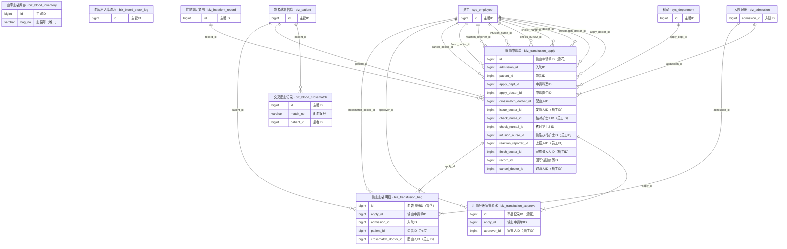

## 16 急诊与全院总值班

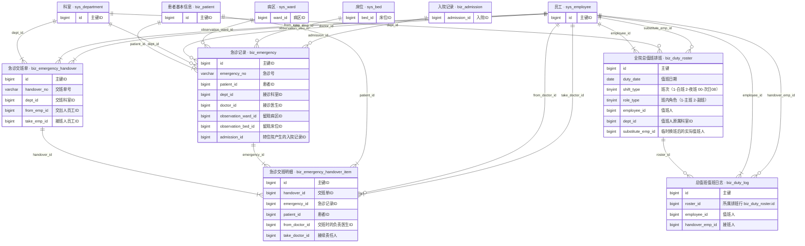

## 17 药房药库（采购·库存·发药·调拨·盘点·静配）

```mermaid
erDiagram
  biz_purchase_order["药品采购订单 · biz_purchase_order"] {
    bigint order_id "采购订单ID"
    varchar order_no "采购订单号"
    bigint supplier_id "供应商ID"
    bigint approver_id "审批人ID"
  }
  biz_purchase_order_detail["药品采购订单明细 · biz_purchase_order_detail"] {
    bigint id "主键ID"
    bigint order_id "采购订单ID"
    bigint drug_id "药品ID"
    varchar batch_no "批号"
  }
  biz_drug_inbound["药品入库单 · biz_drug_inbound"] {
    bigint id "主键ID"
    varchar inbound_no "入库单号（唯一）"
    bigint purchase_order_id "来源采购订单ID"
  }
  biz_drug_inbound_detail["药品入库明细 · biz_drug_inbound_detail"] {
    bigint id "主键ID"
    bigint inbound_id "入库单ID"
    bigint drug_id "药品ID"
  }
  biz_drug_stock["药品批次库存 · biz_drug_stock"] {
    bigint id "主键ID"
    bigint drug_id "药品ID"
    bigint supplier_id "供应商ID"
  }
  biz_drug_stock_log["药品库存流水 · biz_drug_stock_log"] {
    bigint id "主键ID"
    bigint stock_id "库存批次ID"
    bigint drug_id "药品ID"
  }
  biz_drug_outbound["药品出库单 · biz_drug_outbound"] {
    bigint id "主键ID"
    varchar outbound_no "出库单号（唯一）"
  }
  biz_drug_outbound_detail["药品出库明细 · biz_drug_outbound_detail"] {
    bigint id "主键ID"
    bigint outbound_id "出库单ID"
    bigint drug_id "药品ID"
  }
  biz_drug_dispensing["药品发药记录 · biz_drug_dispensing"] {
    bigint id "主键ID"
    varchar dispensing_no "发药单号"
    bigint prescription_id "处方ID"
    bigint patient_id "患者ID"
    bigint drug_id "药品ID"
    bigint pharmacist_id "发药药师ID"
    bigint prescription_detail_id "处方明细ID"
  }
  biz_ward_dispense["住院摆药单 · biz_ward_dispense"] {
    bigint id "主键ID（雪花）"
    varchar dispense_no "摆药单号 WD+yyyyMMdd+4位"
    bigint admission_id "入院ID"
    bigint patient_id "患者ID"
    bigint ward_id "病区ID"
    bigint dept_id "入院科室ID"
  }
  biz_ward_dispense_item["住院摆药明细 · biz_ward_dispense_item"] {
    bigint id "主键ID（雪花）"
    bigint dispense_id "摆药单ID"
    date dispense_date "摆药日期"
    int dispense_seq "重摆序号"
    bigint order_id "住院医嘱ID"
    bigint admission_id "入院ID（冗余）"
    bigint patient_id "患者ID（冗余）"
    bigint ward_id "病区ID"
    bigint drug_id "药品ID"
    bigint fee_record_id "记账行ID"
    bigint dispenser_id "配药人ID"
    bigint checker_id "核对人ID（员工ID）"
  }
  biz_drug_transfer["药品调拨单 · biz_drug_transfer"] {
    bigint id "主键（雪花）"
    varchar transfer_no "调拨单号"
  }
  biz_drug_transfer_item["药品调拨明细 · biz_drug_transfer_item"] {
    bigint id "主键（雪花）"
    bigint transfer_id "调拨单ID"
    bigint stock_id "发出方库存批次ID"
    bigint in_stock_id "接收方库存批次ID"
    bigint drug_id "药品ID"
  }
  biz_drug_supplier_return["药品供应商退货单 · biz_drug_supplier_return"] {
    bigint id "主键（雪花）"
    varchar return_no "退货单号"
    bigint supplier_id "供应商ID"
  }
  biz_drug_supplier_return_item["药品供应商退货明细 · biz_drug_supplier_return_item"] {
    bigint id "主键（雪花）"
    bigint return_id "退货单ID"
    bigint stock_id "库存批次ID"
    bigint drug_id "药品ID"
    bigint supplier_id "批次所属供应商ID"
  }
  biz_drug_trace["药品追溯码台账 · biz_drug_trace"] {
    bigint id "主键ID（雪花）"
    varchar trace_no "院内追溯流水号"
    varchar trace_code "追溯码原文"
    bigint drug_id "药品ID"
    bigint stock_id "采集挂靠批次ID"
    bigint supplier_id "供应商ID"
    bigint inbound_id "来源入库单ID"
    bigint dispensing_id "发药单ID"
    bigint patient_id "患者ID"
    bigint regist_id "门诊挂号ID"
    bigint admission_id "住院ID"
    bigint dept_id "发药科室ID"
  }
  biz_stocktake["药房盘点单 · biz_stocktake"] {
    bigint id "主键（雪花）"
    varchar stocktake_no "盘点单号"
  }
  biz_stocktake_item["药房盘点明细 · biz_stocktake_item"] {
    bigint id "主键（雪花）"
    bigint stocktake_id "盘点单ID"
    bigint stock_id "库存批次ID"
    bigint drug_id "药品ID"
  }
  biz_drug_package["药品耗材套餐 · biz_drug_package"] {
    bigint id
    bigint doctor_id "医生ID"
  }
  biz_drug_package_detail["药品耗材套餐明细 · biz_drug_package_detail"] {
    bigint id
    bigint package_id "套餐ID"
  }
  biz_pivas_batch["静配中心主单 · biz_pivas_batch"] {
    bigint id "主键ID（雪花）"
    varchar pivas_no "静配单号"
    date admix_date "调配日期"
    bigint admission_id "入院ID"
    bigint patient_id "患者ID"
    bigint ward_id "病区ID"
    bigint dept_id "入院科室ID"
  }
  biz_pivas_item["静配中心调配明细 · biz_pivas_item"] {
    bigint id "主键ID（雪花）"
    bigint pivas_id "主单ID"
    date admix_date "调配日期"
    int pivas_seq "重生成序号"
    bigint order_id "住院医嘱ID"
    bigint admission_id "入院ID（冗余）"
    bigint patient_id "患者ID（冗余）"
    bigint ward_id "病区ID"
    bigint drug_id "药品ID"
    bigint auditor_id "审方药师ID（员工ID）"
    bigint compounder_id "调配人ID"
    bigint verifier_id "成品核对人ID"
  }
  biz_admission["入院记录 · biz_admission"] {
    bigint admission_id "入院ID"
  }
  biz_appoint_info["挂号信息 · biz_appoint_info"] {
    bigint id "主键ID"
  }
  biz_consumable_stock["耗材批次库存 · biz_consumable_stock"] {
    bigint id "主键ID"
  }
  biz_fee_record["费用记账流水 · biz_fee_record"] {
    bigint id "主键（雪花）"
  }
  biz_inpatient_order["住院医嘱主表 · biz_inpatient_order"] {
    bigint id "主键ID"
  }
  biz_patient["患者基本信息 · biz_patient"] {
    bigint id "主键ID"
  }
  biz_prescription["处方主表 · biz_prescription"] {
    bigint id
  }
  biz_prescription_detail["处方明细 · biz_prescription_detail"] {
    bigint id
  }
  sys_department["科室 · sys_department"] {
    bigint id "主键ID"
  }
  sys_drug["药品字典 · sys_drug"] {
    bigint id "主键ID"
  }
  sys_employee["员工 · sys_employee"] {
    bigint id "主键ID"
  }
  sys_supplier["供应商 · sys_supplier"] {
    bigint supplier_id "供应商ID"
  }
  sys_ward["病区 · sys_ward"] {
    bigint ward_id "病区ID"
  }
  biz_prescription ||--|{ biz_drug_dispensing : "prescription_id"
  biz_patient ||--|{ biz_drug_dispensing : "patient_id"
  sys_drug ||--|{ biz_drug_dispensing : "drug_id"
  sys_employee ||--o{ biz_drug_dispensing : "pharmacist_id"
  biz_prescription_detail ||--o{ biz_drug_dispensing : "prescription_detail_id"
  biz_purchase_order ||--o{ biz_drug_inbound : "purchase_order_id"
  biz_drug_inbound ||--|{ biz_drug_inbound_detail : "inbound_id"
  sys_drug ||--|{ biz_drug_inbound_detail : "drug_id"
  biz_drug_outbound ||--|{ biz_drug_outbound_detail : "outbound_id"
  sys_drug ||--|{ biz_drug_outbound_detail : "drug_id"
  sys_employee ||--|{ biz_drug_package : "doctor_id"
  biz_drug_package ||--|{ biz_drug_package_detail : "package_id"
  sys_drug ||--|{ biz_drug_stock : "drug_id"
  sys_supplier ||--o{ biz_drug_stock : "supplier_id"
  biz_drug_stock ||--|{ biz_drug_stock_log : "stock_id"
  sys_drug ||--|{ biz_drug_stock_log : "drug_id"
  sys_supplier ||--|{ biz_drug_supplier_return : "supplier_id"
  biz_drug_supplier_return ||--|{ biz_drug_supplier_return_item : "return_id"
  biz_consumable_stock ||--|{ biz_drug_supplier_return_item : "stock_id"
  sys_drug ||--|{ biz_drug_supplier_return_item : "drug_id"
  sys_supplier ||--o{ biz_drug_supplier_return_item : "supplier_id"
  sys_drug ||--|{ biz_drug_trace : "drug_id"
  biz_drug_stock ||--o{ biz_drug_trace : "stock_id"
  sys_supplier ||--o{ biz_drug_trace : "supplier_id"
  biz_drug_inbound ||--o{ biz_drug_trace : "inbound_id"
  biz_drug_dispensing ||--o{ biz_drug_trace : "dispensing_id"
  biz_patient ||--o{ biz_drug_trace : "patient_id"
  biz_appoint_info ||--o{ biz_drug_trace : "regist_id"
  biz_admission ||--o{ biz_drug_trace : "admission_id"
  sys_department ||--o{ biz_drug_trace : "dept_id"
  biz_drug_transfer ||--|{ biz_drug_transfer_item : "transfer_id"
  biz_consumable_stock ||--|{ biz_drug_transfer_item : "stock_id"
  biz_consumable_stock ||--o{ biz_drug_transfer_item : "in_stock_id"
  sys_drug ||--|{ biz_drug_transfer_item : "drug_id"
  biz_admission ||--|{ biz_pivas_batch : "admission_id"
  biz_patient ||--|{ biz_pivas_batch : "patient_id"
  sys_ward ||--|{ biz_pivas_batch : "ward_id"
  sys_department ||--o{ biz_pivas_batch : "dept_id"
  biz_pivas_batch ||--|{ biz_pivas_item : "pivas_id"
  biz_inpatient_order ||--|{ biz_pivas_item : "order_id"
  biz_admission ||--|{ biz_pivas_item : "admission_id"
  biz_patient ||--|{ biz_pivas_item : "patient_id"
  sys_ward ||--o{ biz_pivas_item : "ward_id"
  sys_drug ||--|{ biz_pivas_item : "drug_id"
  sys_employee ||--o{ biz_pivas_item : "auditor_id"
  sys_employee ||--o{ biz_pivas_item : "compounder_id"
  sys_employee ||--o{ biz_pivas_item : "verifier_id"
  sys_supplier ||--|{ biz_purchase_order : "supplier_id"
  sys_employee ||--o{ biz_purchase_order : "approver_id"
  biz_purchase_order ||--|{ biz_purchase_order_detail : "order_id"
  sys_drug ||--|{ biz_purchase_order_detail : "drug_id"
  biz_stocktake ||--|{ biz_stocktake_item : "stocktake_id"
  biz_drug_stock ||--|{ biz_stocktake_item : "stock_id"
  sys_drug ||--|{ biz_stocktake_item : "drug_id"
  biz_admission ||--|{ biz_ward_dispense : "admission_id"
  biz_patient ||--|{ biz_ward_dispense : "patient_id"
  sys_ward ||--|{ biz_ward_dispense : "ward_id"
  sys_department ||--o{ biz_ward_dispense : "dept_id"
  biz_ward_dispense ||--|{ biz_ward_dispense_item : "dispense_id"
  biz_inpatient_order ||--|{ biz_ward_dispense_item : "order_id"
  biz_admission ||--|{ biz_ward_dispense_item : "admission_id"
  biz_patient ||--|{ biz_ward_dispense_item : "patient_id"
  sys_ward ||--o{ biz_ward_dispense_item : "ward_id"
  sys_drug ||--|{ biz_ward_dispense_item : "drug_id"
  biz_fee_record ||--o{ biz_ward_dispense_item : "fee_record_id"
  sys_employee ||--o{ biz_ward_dispense_item : "dispenser_id"
  sys_employee ||--o{ biz_ward_dispense_item : "checker_id"
```

## 18 耗材与消毒供应（CSSD）

```mermaid
erDiagram
  biz_consumable_stock["耗材批次库存 · biz_consumable_stock"] {
    bigint id "主键ID"
    bigint consumable_id "耗材ID"
  }
  biz_consumable_stock_log["耗材出入库流水 · biz_consumable_stock_log"] {
    bigint id "主键ID"
    bigint stock_id "库存批次ID"
    bigint consumable_id "耗材ID"
  }
  biz_consumable_consume["耗材科室领用台账 · biz_consumable_consume"] {
    bigint id "主键ID"
    bigint consumable_id "耗材ID"
    bigint dept_id "领用科室ID"
  }
  biz_consumable_trace["高值耗材使用溯源 · biz_consumable_trace"] {
    bigint id "主键ID（雪花）"
    varchar trace_no "院内追溯码"
    bigint consumable_id "耗材ID"
    bigint stock_id "出库批次ID"
    bigint patient_id "患者ID"
    bigint regist_id "门诊挂号ID"
    bigint admission_id "住院ID"
    bigint dept_id "使用科室ID"
    bigint fee_record_id "记账行ID"
  }
  biz_cssd_pack_template["CSSD 器械包模板 · biz_cssd_pack_template"] {
    bigint id "器械包模板ID"
  }
  biz_cssd_pack_template_item["CSSD 器械包模板明细 · biz_cssd_pack_template_item"] {
    bigint id "明细ID"
    bigint template_id "模板ID"
  }
  biz_cssd_pack["CSSD 器械包 · biz_cssd_pack"] {
    bigint id "器械包ID"
    varchar pack_no "器械包条码"
    bigint dept_id "申领/归属科室ID"
  }
  biz_cssd_trace["CSSD 追溯节点 · biz_cssd_trace"] {
    bigint id "追溯节点ID"
    bigint pack_id "器械包ID"
  }
  biz_admission["入院记录 · biz_admission"] {
    bigint admission_id "入院ID"
  }
  biz_appoint_info["挂号信息 · biz_appoint_info"] {
    bigint id "主键ID"
  }
  biz_fee_record["费用记账流水 · biz_fee_record"] {
    bigint id "主键（雪花）"
  }
  biz_patient["患者基本信息 · biz_patient"] {
    bigint id "主键ID"
  }
  sys_consumable["耗材字典 · sys_consumable"] {
    bigint id "主键ID"
  }
  sys_department["科室 · sys_department"] {
    bigint id "主键ID"
  }
  sys_consumable ||--|{ biz_consumable_consume : "consumable_id"
  sys_department ||--o{ biz_consumable_consume : "dept_id"
  sys_consumable ||--|{ biz_consumable_stock : "consumable_id"
  biz_consumable_stock ||--|{ biz_consumable_stock_log : "stock_id"
  sys_consumable ||--|{ biz_consumable_stock_log : "consumable_id"
  sys_consumable ||--|{ biz_consumable_trace : "consumable_id"
  biz_consumable_stock ||--|{ biz_consumable_trace : "stock_id"
  biz_patient ||--|{ biz_consumable_trace : "patient_id"
  biz_appoint_info ||--o{ biz_consumable_trace : "regist_id"
  biz_admission ||--o{ biz_consumable_trace : "admission_id"
  sys_department ||--o{ biz_consumable_trace : "dept_id"
  biz_fee_record ||--o{ biz_consumable_trace : "fee_record_id"
  sys_department ||--o{ biz_cssd_pack : "dept_id"
  biz_cssd_pack_template ||--|{ biz_cssd_pack_template_item : "template_id"
  biz_cssd_pack ||--|{ biz_cssd_trace : "pack_id"
```

## 19 收费四层（记账·结算·支付·票据）

```mermaid
erDiagram
  biz_fee_record["费用记账流水 · biz_fee_record"] {
    bigint id "主键（雪花）"
    varchar fee_no "记账流水号"
    bigint patient_id "患者ID"
    bigint dept_id "费用归属科室"
    bigint doctor_id "开单/执行人员工ID"
    bigint orig_fee_id "红冲双向指针"
    bigint book_by_id "记账人员工ID"
    bigint bill_id "所属结算账单ID"
  }
  biz_settlement_bill["结算账单 · biz_settlement_bill"] {
    bigint id "主键（雪花）"
    varchar bill_no "账单号"
    bigint patient_id "患者ID"
    bigint bill_by_id "结算人员工ID"
    bigint void_by_id "作废操作人"
    bigint orig_bill_id "红冲指针"
  }
  biz_settlement_bill_item["结算账单行 · biz_settlement_bill_item"] {
    bigint id "主键（雪花）"
    bigint bill_id "账单ID"
    bigint fee_record_id "来源记账行ID"
    bigint patient_id "患者ID"
    bigint dept_id "费用归属科室"
  }
  biz_payment_txn["支付资金流水 · biz_payment_txn"] {
    bigint id "主键（雪花）"
    varchar txn_no "支付流水号"
    bigint bill_id "结算账单ID"
    bigint patient_id "患者ID"
    bigint orig_txn_id "退款/冲正指向的原收款流水ID"
    bigint cashier_id "收银/退款人员工ID"
    bigint cashier_settlement_id "所属交班单ID"
    bigint apply_id "来源退费申请ID"
  }
  biz_pay_order["患者端统一支付单 · biz_pay_order"] {
    bigint id "主键（雪花）"
    varchar pay_no "支付单号"
    bigint patient_id "患者ID"
  }
  biz_fund_account["资金账户 · biz_fund_account"] {
    bigint id "主键（雪花）"
    tinyint owner_type "账户主体（1-患者 2-住院就诊次）"
    bigint owner_id "主体ID"
    bigint patient_id "患者ID"
  }
  biz_fund_account_txn["资金账户流水 · biz_fund_account_txn"] {
    bigint id "主键（雪花）"
    varchar txn_no "账户流水号"
    bigint account_id "账户ID"
    bigint patient_id "患者ID"
    bigint admission_id "入院ID"
    bigint bill_id "关联账单ID"
    bigint payment_txn_id "关联支付流水ID"
    bigint operator_id "操作人员工ID"
    bigint orig_txn_id "冲正指向的原流水ID"
  }
  biz_refund_apply["退费申请单 · biz_refund_apply"] {
    bigint id "主键ID"
    varchar refund_apply_no "退费申请号"
    bigint bill_id "原结算账单ID"
    bigint patient_id "患者ID"
    bigint auditor_id "审核人ID"
  }
  biz_invoice["发票 · biz_invoice"] {
    bigint id "主键ID"
    varchar invoice_no "发票号"
    bigint bill_id "结算账单ID"
    bigint orig_invoice_id "红冲链"
    bigint patient_id "患者ID"
  }
  biz_cashier_settlement["收费员班结单 · biz_cashier_settlement"] {
    bigint id "主键ID"
    varchar settlement_no "交班单号"
    bigint cashier_id "收费员工号"
    bigint day_settlement_id "所属院级日结单ID"
  }
  biz_day_settlement["院级日结单 · biz_day_settlement"] {
    bigint id "主键ID"
    varchar settlement_no "日结单号"
    date settle_date "日结日期"
  }
  biz_pay_channel_bill["支付渠道对账流水 · biz_pay_channel_bill"] {
    bigint id "主键（雪花）"
    tinyint channel "支付渠道（2-微信 3-支付宝 6-银行卡）"
    varchar channel_trade_no "渠道流水号"
    varchar local_txn_no "勾对的本地支付流水号"
    bigint local_txn_id "勾对的本地支付流水ID"
    bigint matched_by_id "勾对人员工ID"
  }
  biz_inpatient_settlement["住院结算单 · biz_inpatient_settlement"] {
    bigint id "结算单ID"
    varchar settlement_no "结算单号（唯一）"
    bigint admission_id "入院ID"
    bigint patient_id "患者ID"
    bigint settle_by "结算人（员工ID）"
  }
  biz_prepay["住院预交金流水 · biz_prepay"] {
    bigint id "预交金流水ID"
    varchar prepay_no "预交金单号（唯一）"
    bigint admission_id "入院ID"
    bigint patient_id "患者ID"
    bigint operator_id "操作人"
  }
  biz_arrears_policy["住院欠费管控策略 · biz_arrears_policy"] {
    bigint id "策略ID"
  }
  biz_stat_daily["日统计汇总 · biz_stat_daily"] {
    bigint stat_id "统计ID"
    date stat_date "统计日期"
    bigint dept_id "科室ID"
  }
  biz_stat_dept["科室统计汇总 · biz_stat_dept"] {
    bigint stat_id "统计ID"
    date stat_date "统计日期"
    bigint dept_id "科室ID"
  }
  biz_admission["入院记录 · biz_admission"] {
    bigint admission_id "入院ID"
  }
  biz_patient["患者基本信息 · biz_patient"] {
    bigint id "主键ID"
  }
  sys_department["科室 · sys_department"] {
    bigint id "主键ID"
  }
  sys_employee["员工 · sys_employee"] {
    bigint id "主键ID"
  }
  sys_employee ||--|{ biz_cashier_settlement : "cashier_id"
  biz_day_settlement ||--o{ biz_cashier_settlement : "day_settlement_id"
  biz_patient ||--|{ biz_fee_record : "patient_id"
  sys_department ||--o{ biz_fee_record : "dept_id"
  sys_employee ||--o{ biz_fee_record : "doctor_id"
  biz_fee_record ||--o{ biz_fee_record : "orig_fee_id"
  sys_employee ||--o{ biz_fee_record : "book_by_id"
  biz_settlement_bill ||--o{ biz_fee_record : "bill_id"
  biz_patient ||--|{ biz_fund_account : "patient_id"
  biz_fund_account ||--|{ biz_fund_account_txn : "account_id"
  biz_patient ||--|{ biz_fund_account_txn : "patient_id"
  biz_admission ||--o{ biz_fund_account_txn : "admission_id"
  biz_pay_channel_bill ||--o{ biz_fund_account_txn : "bill_id"
  biz_payment_txn ||--o{ biz_fund_account_txn : "payment_txn_id"
  sys_employee ||--o{ biz_fund_account_txn : "operator_id"
  biz_payment_txn ||--o{ biz_fund_account_txn : "orig_txn_id"
  biz_admission ||--|{ biz_inpatient_settlement : "admission_id"
  biz_patient ||--|{ biz_inpatient_settlement : "patient_id"
  sys_employee ||--o{ biz_inpatient_settlement : "settle_by"
  biz_settlement_bill ||--o{ biz_invoice : "bill_id"
  biz_invoice ||--o{ biz_invoice : "orig_invoice_id"
  biz_patient ||--|{ biz_invoice : "patient_id"
  biz_payment_txn ||--o{ biz_pay_channel_bill : "local_txn_id"
  sys_employee ||--o{ biz_pay_channel_bill : "matched_by_id"
  biz_patient ||--o{ biz_pay_order : "patient_id"
  biz_settlement_bill ||--o{ biz_payment_txn : "bill_id"
  biz_patient ||--|{ biz_payment_txn : "patient_id"
  biz_payment_txn ||--o{ biz_payment_txn : "orig_txn_id"
  sys_employee ||--|{ biz_payment_txn : "cashier_id"
  biz_cashier_settlement ||--o{ biz_payment_txn : "cashier_settlement_id"
  biz_refund_apply ||--o{ biz_payment_txn : "apply_id"
  biz_admission ||--|{ biz_prepay : "admission_id"
  biz_patient ||--|{ biz_prepay : "patient_id"
  sys_employee ||--o{ biz_prepay : "operator_id"
  biz_settlement_bill ||--o{ biz_refund_apply : "bill_id"
  biz_patient ||--|{ biz_refund_apply : "patient_id"
  sys_employee ||--o{ biz_refund_apply : "auditor_id"
  biz_patient ||--|{ biz_settlement_bill : "patient_id"
  sys_employee ||--o{ biz_settlement_bill : "bill_by_id"
  sys_employee ||--o{ biz_settlement_bill : "void_by_id"
  biz_pay_channel_bill ||--o{ biz_settlement_bill : "orig_bill_id"
  biz_settlement_bill ||--|{ biz_settlement_bill_item : "bill_id"
  biz_fee_record ||--|{ biz_settlement_bill_item : "fee_record_id"
  biz_patient ||--|{ biz_settlement_bill_item : "patient_id"
  sys_department ||--o{ biz_settlement_bill_item : "dept_id"
  biz_stat_dept ||--o{ biz_stat_daily : "dept_id"
  sys_department ||--|{ biz_stat_dept : "dept_id"
```

## 20 院感·公卫·医疗安全与死亡登记

```mermaid
erDiagram
  biz_infection_case["院感病例报告卡 · biz_infection_case"] {
    bigint id "主键"
    varchar case_no "病例编号"
    bigint patient_id "患者ID"
    bigint regist_id "门诊就诊ID"
    bigint inp_id "住院记录ID"
    bigint dept_id "发现科室ID"
    bigint report_by "上报人ID"
  }
  biz_infection_monitor["院感目标性监测登记 · biz_infection_monitor"] {
    bigint id "主键"
    varchar monitor_no "监测编号"
    bigint patient_id "患者ID"
    bigint dept_id "监测科室ID"
  }
  biz_infection_monitor_daily["监测每日打卡 · biz_infection_monitor_daily"] {
    bigint id "主键"
    bigint monitor_id "监测登记ID"
    bigint recorder_id "记录人ID"
  }
  biz_hand_hygiene_obs["手卫生依从性观察记录 · biz_hand_hygiene_obs"] {
    bigint id "主键"
    bigint dept_id "被观察科室ID"
    bigint observer_id "观察人ID"
  }
  biz_infectious_report["传染病报告卡 · biz_infectious_report"] {
    bigint id "主键"
    varchar report_no "报卡编号"
    bigint patient_id "患者ID"
    bigint regist_id "门诊就诊ID"
    bigint inp_id "住院记录ID"
    bigint visit_dept_id "发现/就诊科室ID"
    bigint disease_id "病种ID"
    bigint report_by "填卡医生ID"
  }
  biz_public_health_report["公卫上报表 · biz_public_health_report"] {
    bigint id "主键ID"
    varchar report_no "上报编号"
    bigint patient_id "患者ID"
    bigint record_id "病历ID"
  }
  biz_adverse_event["不良事件上报 · biz_adverse_event"] {
    bigint id "主键ID（雪花）"
    varchar event_no "事件编号 AE+yyyyMMdd+4位"
    bigint occur_dept_id "发生科室 sys_department.id"
    bigint occur_ward_id "发生病区ID"
    bigint patient_id "关联患者"
    bigint visit_id "关联就诊 biz_regist_info.id（可空）"
    bigint reporter_id "上报人员工ID"
    bigint handler_id "处理人员工ID"
    bigint rectify_by_id "整改人员工ID"
    bigint close_by_id "结案人员工ID"
  }
  biz_medical_waste["医疗废物登记 · biz_medical_waste"] {
    bigint id "医废登记ID"
    varchar waste_no "医废交接单号"
    bigint dept_id "产生科室ID"
  }
  biz_death_certificate["死亡医学证明书 · biz_death_certificate"] {
    bigint id "主键（雪花ID）"
    varchar cert_no "证明编号"
    bigint admission_id "住院记录ID"
    bigint discharge_id "死亡出院记录ID"
    bigint patient_id "患者ID"
    bigint death_dept_id "死亡科室ID"
    bigint physician_id "填表医师ID"
    bigint reviewer_id "审核人ID"
    bigint orig_cert_id "重开来源证明ID"
  }
  biz_death_certificate_cause["死亡证明死因链 · biz_death_certificate_cause"] {
    bigint id "主键（雪花ID）"
    bigint cert_id "死亡证明ID"
    tinyint part "部分（1-Ⅰ部分死因链 2-Ⅱ部分其他疾病）"
    tinyint seq_no "行序"
  }
  biz_death_registration["住院死亡登记簿 · biz_death_registration"] {
    bigint id "主键（雪花ID）"
    varchar register_no "死亡登记号"
    bigint admission_id "住院记录ID"
    bigint cert_id "死亡证明ID"
    bigint patient_id "患者ID"
    bigint death_dept_id "死亡科室ID"
    bigint registrar_id "登记人ID（值班医师/病区护士/防保科）"
  }
  biz_dispute_case["医疗纠纷投诉主单 · biz_dispute_case"] {
    bigint id "主键ID（雪花）"
    varchar case_no "单据编号"
    bigint patient_id "患者ID"
    bigint admission_id "关联住院ID"
    bigint dept_id "被投诉科室ID"
    bigint archive_id "已封存病案ID"
  }
  biz_dispute_flow["纠纷投诉处理台账 · biz_dispute_flow"] {
    bigint id "主键ID（雪花）"
    bigint case_id "主单ID"
    bigint operator_id "操作人（员工ID）"
  }
  biz_admission["入院记录 · biz_admission"] {
    bigint admission_id "入院ID"
  }
  biz_appoint_info["挂号信息 · biz_appoint_info"] {
    bigint id "主键ID"
  }
  biz_discharge["出院记录 · biz_discharge"] {
    bigint discharge_id "出院ID"
  }
  biz_medical_record["门诊病历 · biz_medical_record"] {
    bigint id
  }
  biz_medical_record_archive["病历归档 · biz_medical_record_archive"] {
    bigint id "主键ID"
  }
  biz_patient["患者基本信息 · biz_patient"] {
    bigint id "主键ID"
  }
  biz_patient_past_disease["既往疾病史 · biz_patient_past_disease"] {
    bigint id "主键ID"
  }
  biz_visit["就诊次 · biz_visit"] {
    bigint visit_id "就诊次ID"
  }
  sys_department["科室 · sys_department"] {
    bigint id "主键ID"
  }
  sys_employee["员工 · sys_employee"] {
    bigint id "主键ID"
  }
  sys_ward["病区 · sys_ward"] {
    bigint ward_id "病区ID"
  }
  sys_department ||--|{ biz_adverse_event : "occur_dept_id"
  sys_ward ||--o{ biz_adverse_event : "occur_ward_id"
  biz_patient ||--o{ biz_adverse_event : "patient_id"
  biz_visit ||--o{ biz_adverse_event : "visit_id"
  sys_employee ||--|{ biz_adverse_event : "reporter_id"
  sys_employee ||--o{ biz_adverse_event : "handler_id"
  sys_employee ||--o{ biz_adverse_event : "rectify_by_id"
  sys_employee ||--o{ biz_adverse_event : "close_by_id"
  biz_admission ||--|{ biz_death_certificate : "admission_id"
  biz_discharge ||--o{ biz_death_certificate : "discharge_id"
  biz_patient ||--|{ biz_death_certificate : "patient_id"
  sys_department ||--o{ biz_death_certificate : "death_dept_id"
  sys_employee ||--o{ biz_death_certificate : "physician_id"
  sys_employee ||--o{ biz_death_certificate : "reviewer_id"
  biz_death_certificate ||--o{ biz_death_certificate : "orig_cert_id"
  biz_death_certificate ||--|{ biz_death_certificate_cause : "cert_id"
  biz_admission ||--|{ biz_death_registration : "admission_id"
  biz_death_certificate ||--o{ biz_death_registration : "cert_id"
  biz_patient ||--|{ biz_death_registration : "patient_id"
  sys_department ||--o{ biz_death_registration : "death_dept_id"
  sys_employee ||--o{ biz_death_registration : "registrar_id"
  biz_patient ||--o{ biz_dispute_case : "patient_id"
  biz_admission ||--o{ biz_dispute_case : "admission_id"
  sys_department ||--o{ biz_dispute_case : "dept_id"
  biz_medical_record_archive ||--o{ biz_dispute_case : "archive_id"
  biz_dispute_case ||--|{ biz_dispute_flow : "case_id"
  sys_employee ||--o{ biz_dispute_flow : "operator_id"
  sys_department ||--|{ biz_hand_hygiene_obs : "dept_id"
  sys_employee ||--|{ biz_hand_hygiene_obs : "observer_id"
  biz_patient ||--|{ biz_infection_case : "patient_id"
  biz_appoint_info ||--o{ biz_infection_case : "regist_id"
  biz_admission ||--o{ biz_infection_case : "inp_id"
  sys_department ||--o{ biz_infection_case : "dept_id"
  sys_employee ||--|{ biz_infection_case : "report_by"
  biz_patient ||--|{ biz_infection_monitor : "patient_id"
  sys_department ||--o{ biz_infection_monitor : "dept_id"
  biz_infection_monitor ||--|{ biz_infection_monitor_daily : "monitor_id"
  sys_employee ||--|{ biz_infection_monitor_daily : "recorder_id"
  biz_patient ||--|{ biz_infectious_report : "patient_id"
  biz_appoint_info ||--o{ biz_infectious_report : "regist_id"
  biz_admission ||--o{ biz_infectious_report : "inp_id"
  sys_department ||--o{ biz_infectious_report : "visit_dept_id"
  biz_patient_past_disease ||--|{ biz_infectious_report : "disease_id"
  sys_employee ||--|{ biz_infectious_report : "report_by"
  sys_department ||--o{ biz_medical_waste : "dept_id"
  biz_patient ||--|{ biz_public_health_report : "patient_id"
  biz_medical_record ||--o{ biz_public_health_report : "record_id"
```

## 21 专项质控与专科管理（路径·抗菌药物·VTE·营养·体检·透析·监护）

```mermaid
erDiagram
  biz_pathway["临床路径模板 · biz_pathway"] {
    bigint id "主键ID（雪花）"
    bigint dept_id "适用科室ID"
  }
  biz_pathway_step["临床路径步骤 · biz_pathway_step"] {
    bigint id "主键ID（雪花）"
    bigint pathway_id "模板ID"
  }
  biz_pathway_enroll["临床路径入径记录 · biz_pathway_enroll"] {
    bigint id "主键ID（雪花）"
    varchar enroll_no "入径单号"
    bigint pathway_id "模板ID"
    bigint admission_id "入院ID"
    bigint patient_id "患者ID"
    bigint dept_id "入院科室ID"
  }
  biz_pathway_variance["临床路径变异登记 · biz_pathway_variance"] {
    bigint id "主键ID（雪花）"
    bigint enroll_id "入径记录ID"
    bigint recorder_id "登记人（员工ID）"
  }
  biz_clinical_rule_check["临床规则校验记录 · biz_clinical_rule_check"] {
    bigint id "主键ID"
    varchar check_no "校验编号"
    bigint record_id "病历ID"
    bigint patient_id "患者ID"
  }
  biz_antibiotic_alias["抗菌药物品名别名 · biz_antibiotic_alias"] {
    bigint id "主键"
    bigint drug_id "药品ID"
    varchar alias_name "别名"
  }
  biz_antibiotic_auth["抗菌药物处方权授权 · biz_antibiotic_auth"] {
    bigint id "主键"
    bigint doctor_id "医师ID"
    bigint dept_id "科室ID"
    tinyint auth_level "授权级别（1-非限制使用级 2-限制使用级 3-特殊使用级）"
  }
  biz_antibiotic_stats["抗菌药物使用监测指标 · biz_antibiotic_stats"] {
    bigint id "主键"
    char stat_month "统计月份"
    tinyint scope_type "统计范围（1-全院 2-科室）"
    bigint dept_id "科室ID"
  }
  biz_antibiotic_incision_review["I 类切口预防用药点评 · biz_antibiotic_incision_review"] {
    bigint id "主键"
    bigint operation_apply_id "手术申请单ID"
    bigint admission_id "入院ID"
    bigint patient_id "患者ID"
    bigint drug_id "预防用药药品ID"
    bigint reviewer_id "点评人员工ID"
  }
  biz_single_disease_case["单病种质控病例 · biz_single_disease_case"] {
    bigint id "主键（雪花）"
    varchar case_no "病例编号"
    bigint disease_id "病种ID"
    bigint admission_id "住院ID"
    bigint patient_id "患者ID"
  }
  biz_vte_stats["VTE 防控月度指标 · biz_vte_stats"] {
    bigint id "主键"
    char stat_month "统计月份"
    tinyint scope_type "统计范围（1-全院 2-科室）"
    bigint dept_id "科室ID"
  }
  biz_vte_prevent["VTE 预防措施记录 · biz_vte_prevent"] {
    bigint id "主键"
    bigint admission_id "入院ID"
    bigint patient_id "患者ID"
    bigint dept_id "科室ID"
    bigint ward_id "病区ID"
    bigint assessment_id "来源评估单ID"
    varchar measure_code "措施码"
    bigint executor_id "执行人（员工ID）"
  }
  biz_vte_event["VTE 事件登记 · biz_vte_event"] {
    bigint id "主键"
    bigint admission_id "入院ID"
    bigint patient_id "患者ID"
    bigint dept_id "科室ID"
    bigint ward_id "病区ID"
    bigint reporter_id "登记人（员工ID）"
  }
  biz_nutrition_screen["营养风险筛查记录 · biz_nutrition_screen"] {
    bigint id "主键"
    varchar screen_no "筛查编号"
    bigint admission_id "入院ID"
    bigint patient_id "患者ID"
    bigint dept_id "科室ID"
    bigint ward_id "病区ID"
    bigint screener_id "筛查人（员工ID）"
  }
  biz_diet_plan["膳食方案 · biz_diet_plan"] {
    bigint id "主键"
    varchar diet_no "膳食方案编号"
    bigint admission_id "入院ID"
    bigint patient_id "患者ID"
    bigint dept_id "科室ID"
    bigint ward_id "病区ID"
    bigint order_id "来源医嘱ID"
    bigint confirmer_id "接收人"
  }
  biz_meal_order["住院订餐配送 · biz_meal_order"] {
    bigint id "主键"
    varchar meal_no "订餐单号"
    bigint admission_id "入院ID"
    bigint patient_id "患者ID"
    bigint dept_id "科室ID"
    bigint ward_id "病区ID"
    bigint diet_plan_id "来源膳食方案ID"
    date meal_date "就餐日期"
    tinyint meal_type "餐次（1-早餐 2-午餐 3-晚餐 4-加餐）"
    bigint deliver_by_id "配送人（员工ID）"
  }
  biz_nutrition_stats["营养膳食月度指标 · biz_nutrition_stats"] {
    bigint id "主键"
    char stat_month "统计月份"
    tinyint scope_type "统计范围（1-全院 2-科室）"
    bigint dept_id "科室ID"
  }
  biz_checkup_record["体检登记 · biz_checkup_record"] {
    bigint id "主键ID"
    varchar record_no "体检编号"
    bigint patient_id "体检人ID"
    bigint package_id "套餐ID"
  }
  biz_checkup_result["体检结果明细 · biz_checkup_result"] {
    bigint id "主键ID"
    bigint record_id "体检登记ID"
  }
  biz_dialysis_machine["透析机位台账 · biz_dialysis_machine"] {
    bigint id "主键ID（雪花）"
    varchar machine_no "机位号"
    tinyint del_flag "删除标志（0-正常 1-删除）"
  }
  biz_dialysis_patient["透析患者档案 · biz_dialysis_patient"] {
    bigint id "主键ID（雪花）"
    varchar dialysis_no "透析号"
    bigint patient_id "患者ID"
    tinyint del_flag "删除标志（0-正常 1-删除）"
  }
  biz_dialysis_prescription["透析处方 · biz_dialysis_prescription"] {
    bigint id "主键ID（雪花）"
    bigint archive_id "透析档案ID"
    bigint doctor_id "开立医生（员工ID）"
  }
  biz_dialysis_session["透析单 · biz_dialysis_session"] {
    bigint id "主键ID（雪花）"
    varchar session_no "透析单号"
    bigint machine_id "机位ID"
    bigint archive_id "透析档案ID"
    bigint patient_id "患者ID"
    bigint prescription_id "使用的透析处方ID"
    varchar slot_key "机位时段占用键"
  }
  biz_icu_stay["ICU 入出科登记 · biz_icu_stay"] {
    bigint id "主键ID（雪花）"
    varchar stay_no "入科单号"
    bigint admission_id "入院ID"
    bigint patient_id "患者ID"
    bigint from_dept_id "入科来源科室ID"
    bigint ward_id "ICU 病区ID"
    bigint bed_id "ICU 床位ID"
  }
  biz_icu_monitor["ICU 监护记录单 · biz_icu_monitor"] {
    bigint id "主键ID（雪花）"
    bigint stay_id "入科记录ID"
    datetime record_time "记录时刻"
    bigint recorder_id "记录人（员工ID）"
    tinyint del_flag "删除标志（0-正常 1-删除）"
  }
  biz_treatment_apply["治疗申请单 · biz_treatment_apply"] {
    bigint apply_id "治疗申请ID"
    varchar apply_no "治疗申请单号"
    bigint patient_id "患者ID"
    bigint visit_id "就诊次ID"
    bigint regist_id "挂号ID"
    bigint doctor_id "开单医生ID"
    bigint treatment_item_id "治疗项目ID"
    bigint dept_id "开单科室ID"
    bigint exec_dept_id "建议执行科室ID"
  }
  biz_treatment_record["治疗执行记录 · biz_treatment_record"] {
    bigint record_id "治疗记录ID"
    varchar record_no "治疗记录编号"
    bigint apply_id "治疗申请ID"
    bigint treatment_item_id "治疗项目ID"
    bigint execute_doctor_id "执行医生ID"
    bigint nurse_id "执行护士ID"
    int exec_seq "第几次执行"
    bigint fee_record_id "记账行ID"
  }
  biz_admission["入院记录 · biz_admission"] {
    bigint admission_id "入院ID"
  }
  biz_appoint_info["挂号信息 · biz_appoint_info"] {
    bigint id "主键ID"
  }
  biz_fee_record["费用记账流水 · biz_fee_record"] {
    bigint id "主键（雪花）"
  }
  biz_inpatient_order["住院医嘱主表 · biz_inpatient_order"] {
    bigint id "主键ID"
  }
  biz_medical_record["门诊病历 · biz_medical_record"] {
    bigint id
  }
  biz_nursing_assessment["护理评估单 · biz_nursing_assessment"] {
    bigint id "主键ID（雪花）"
  }
  biz_operation_apply["手术申请单 · biz_operation_apply"] {
    bigint id "手术申请单ID（雪花）"
  }
  biz_patient["患者基本信息 · biz_patient"] {
    bigint id "主键ID"
  }
  biz_visit["就诊次 · biz_visit"] {
    bigint visit_id "就诊次ID"
  }
  sys_bed["床位 · sys_bed"] {
    bigint bed_id "床位ID"
  }
  sys_checkup_package["体检套餐 · sys_checkup_package"] {
    bigint id "主键ID"
  }
  sys_department["科室 · sys_department"] {
    bigint id "主键ID"
  }
  sys_drug["药品字典 · sys_drug"] {
    bigint id "主键ID"
  }
  sys_employee["员工 · sys_employee"] {
    bigint id "主键ID"
  }
  sys_single_disease["单病种质控目录 · sys_single_disease"] {
    bigint id "主键（雪花）"
  }
  sys_treatment_item["治疗项目字典 · sys_treatment_item"] {
    bigint id "主键ID"
  }
  sys_ward["病区 · sys_ward"] {
    bigint ward_id "病区ID"
  }
  sys_drug ||--|{ biz_antibiotic_alias : "drug_id"
  sys_employee ||--|{ biz_antibiotic_auth : "doctor_id"
  sys_department ||--o{ biz_antibiotic_auth : "dept_id"
  biz_operation_apply ||--|| biz_antibiotic_incision_review : "operation_apply_id"
  biz_admission ||--o{ biz_antibiotic_incision_review : "admission_id"
  biz_patient ||--o{ biz_antibiotic_incision_review : "patient_id"
  sys_drug ||--o{ biz_antibiotic_incision_review : "drug_id"
  sys_employee ||--o{ biz_antibiotic_incision_review : "reviewer_id"
  sys_department ||--o{ biz_antibiotic_stats : "dept_id"
  biz_patient ||--|{ biz_checkup_record : "patient_id"
  sys_checkup_package ||--|{ biz_checkup_record : "package_id"
  biz_checkup_record ||--|{ biz_checkup_result : "record_id"
  biz_medical_record ||--|{ biz_clinical_rule_check : "record_id"
  biz_patient ||--|{ biz_clinical_rule_check : "patient_id"
  biz_patient ||--|{ biz_dialysis_patient : "patient_id"
  biz_dialysis_patient ||--|{ biz_dialysis_prescription : "archive_id"
  sys_employee ||--o{ biz_dialysis_prescription : "doctor_id"
  biz_dialysis_machine ||--|{ biz_dialysis_session : "machine_id"
  biz_dialysis_patient ||--|{ biz_dialysis_session : "archive_id"
  biz_patient ||--|{ biz_dialysis_session : "patient_id"
  biz_dialysis_prescription ||--|{ biz_dialysis_session : "prescription_id"
  biz_admission ||--|{ biz_diet_plan : "admission_id"
  biz_patient ||--o{ biz_diet_plan : "patient_id"
  sys_department ||--o{ biz_diet_plan : "dept_id"
  sys_ward ||--o{ biz_diet_plan : "ward_id"
  biz_inpatient_order ||--|| biz_diet_plan : "order_id"
  sys_employee ||--o{ biz_diet_plan : "confirmer_id"
  biz_icu_stay ||--|{ biz_icu_monitor : "stay_id"
  sys_employee ||--o{ biz_icu_monitor : "recorder_id"
  biz_admission ||--|{ biz_icu_stay : "admission_id"
  biz_patient ||--|{ biz_icu_stay : "patient_id"
  sys_department ||--o{ biz_icu_stay : "from_dept_id"
  sys_ward ||--|{ biz_icu_stay : "ward_id"
  sys_bed ||--|{ biz_icu_stay : "bed_id"
  biz_admission ||--|{ biz_meal_order : "admission_id"
  biz_patient ||--o{ biz_meal_order : "patient_id"
  sys_department ||--o{ biz_meal_order : "dept_id"
  sys_ward ||--o{ biz_meal_order : "ward_id"
  biz_diet_plan ||--o{ biz_meal_order : "diet_plan_id"
  sys_employee ||--o{ biz_meal_order : "deliver_by_id"
  biz_admission ||--|{ biz_nutrition_screen : "admission_id"
  biz_patient ||--o{ biz_nutrition_screen : "patient_id"
  sys_department ||--o{ biz_nutrition_screen : "dept_id"
  sys_ward ||--o{ biz_nutrition_screen : "ward_id"
  sys_employee ||--o{ biz_nutrition_screen : "screener_id"
  sys_department ||--o{ biz_nutrition_stats : "dept_id"
  sys_department ||--o{ biz_pathway : "dept_id"
  biz_pathway ||--|{ biz_pathway_enroll : "pathway_id"
  biz_admission ||--|{ biz_pathway_enroll : "admission_id"
  biz_patient ||--|{ biz_pathway_enroll : "patient_id"
  sys_department ||--o{ biz_pathway_enroll : "dept_id"
  biz_pathway ||--|{ biz_pathway_step : "pathway_id"
  biz_pathway_enroll ||--|{ biz_pathway_variance : "enroll_id"
  sys_employee ||--o{ biz_pathway_variance : "recorder_id"
  sys_single_disease ||--|{ biz_single_disease_case : "disease_id"
  biz_admission ||--|{ biz_single_disease_case : "admission_id"
  biz_patient ||--o{ biz_single_disease_case : "patient_id"
  biz_patient ||--|{ biz_treatment_apply : "patient_id"
  biz_visit ||--o{ biz_treatment_apply : "visit_id"
  biz_appoint_info ||--o{ biz_treatment_apply : "regist_id"
  sys_employee ||--|{ biz_treatment_apply : "doctor_id"
  sys_treatment_item ||--|{ biz_treatment_apply : "treatment_item_id"
  sys_department ||--o{ biz_treatment_apply : "dept_id"
  sys_department ||--o{ biz_treatment_apply : "exec_dept_id"
  biz_treatment_apply ||--|{ biz_treatment_record : "apply_id"
  sys_treatment_item ||--|{ biz_treatment_record : "treatment_item_id"
  sys_employee ||--o{ biz_treatment_record : "execute_doctor_id"
  sys_employee ||--o{ biz_treatment_record : "nurse_id"
  biz_fee_record ||--o{ biz_treatment_record : "fee_record_id"
  biz_admission ||--|{ biz_vte_event : "admission_id"
  biz_patient ||--o{ biz_vte_event : "patient_id"
  sys_department ||--o{ biz_vte_event : "dept_id"
  sys_ward ||--o{ biz_vte_event : "ward_id"
  sys_employee ||--o{ biz_vte_event : "reporter_id"
  biz_admission ||--|{ biz_vte_prevent : "admission_id"
  biz_patient ||--o{ biz_vte_prevent : "patient_id"
  sys_department ||--o{ biz_vte_prevent : "dept_id"
  sys_ward ||--o{ biz_vte_prevent : "ward_id"
  biz_nursing_assessment ||--o{ biz_vte_prevent : "assessment_id"
  sys_employee ||--o{ biz_vte_prevent : "executor_id"
  sys_department ||--o{ biz_vte_stats : "dept_id"
```

## 22 互联网医院·随访·满意度·消息与工作台

```mermaid
erDiagram
  biz_online_consult["线上问诊 · biz_online_consult"] {
    bigint id "主键ID（雪花）"
    varchar consult_no "问诊单号"
    bigint patient_id "患者ID"
    bigint dept_id "接诊科室ID"
    bigint doctor_id "接诊医生ID（员工ID）"
  }
  biz_tele_consult["远程会诊 · biz_tele_consult"] {
    bigint id "主键ID（雪花）"
    varchar consult_no "会诊单号"
    bigint patient_id "患者ID"
    bigint admission_id "关联住院ID"
    bigint apply_dept_id "申请科室ID"
    bigint apply_doctor_id "申请医生ID（员工ID）"
  }
  biz_referral["转诊 · biz_referral"] {
    bigint referral_id "转诊ID"
    varchar referral_no "转诊编号"
    bigint patient_id "患者ID"
    bigint visit_id "就诊次ID"
    bigint from_dept_id "转出科室ID"
    bigint to_dept_id "转入科室ID"
    bigint admission_id "入院ID"
    bigint audit_by "确认人（员工ID）"
  }
  biz_followup_task["随访任务 · biz_followup_task"] {
    bigint id "主键ID"
    varchar task_no "任务编号"
    bigint patient_id "患者ID"
    bigint dept_id "随访所属科室ID"
    bigint executor_id "执行人ID"
    bigint revisit_record_id "复诊引用的原病历ID"
    bigint revisit_appoint_id "由本任务生成的复诊挂号ID"
  }
  biz_survey_template["满意度问卷模板 · biz_survey_template"] {
    bigint id "主键ID（雪花）"
    varchar template_no "模板编号"
  }
  biz_survey_item["满意度问卷题目 · biz_survey_item"] {
    bigint id "主键ID（雪花）"
    bigint template_id "模板ID"
    int seq_no "题号"
  }
  biz_survey_dispatch["满意度发放台账 · biz_survey_dispatch"] {
    bigint id "主键ID（雪花）"
    varchar dispatch_no "发放单号"
    bigint template_id "问卷模板ID"
    tinyint source_type "发放来源（1-随访任务 2-出院结算 3-人工补发）"
    bigint source_id "来源单据ID"
    bigint patient_id "患者ID"
    bigint dept_id "就诊科室ID"
    bigint answer_id "回收到的答卷ID"
  }
  biz_survey_answer["满意度答卷 · biz_survey_answer"] {
    bigint id "主键ID（雪花）"
    varchar answer_no "答卷编号"
    bigint dispatch_id "发放单ID"
    bigint template_id "模板ID"
    bigint patient_id "患者ID"
    bigint dept_id "就诊科室ID"
    bigint fill_employee_id "代填人（员工ID）"
    bigint dispute_case_id "低分自动转出的投诉单ID"
  }
  biz_survey_answer_item["满意度逐题答案 · biz_survey_answer_item"] {
    bigint id "主键ID（雪花）"
    bigint answer_id "答卷ID"
    bigint item_id "题目ID"
    bigint template_id "模板ID"
  }
  sys_message["消息通知 · sys_message"] {
    bigint message_id "消息ID"
    varchar message_no "消息编号"
    bigint receiver_id "接收人ID"
  }
  sys_alert_rule["预警规则 · sys_alert_rule"] {
    bigint rule_id "规则ID"
  }
  biz_alert["预警记录 · biz_alert"] {
    bigint alert_id "预警ID"
    varchar alert_no "预警编号"
    bigint rule_id "规则ID"
    bigint notify_user_id "通知用户ID"
  }
  sys_workbench_widget["工作台卡片注册表 · sys_workbench_widget"] {
    bigint id "主键ID（雪花）"
    varchar widget_code "卡片编码"
  }
  sys_workbench_role["角色工作台配置 · sys_workbench_role"] {
    bigint id "主键ID（雪花）"
    bigint role_id "角色ID"
    bigint widget_id "卡片ID"
  }
  sys_workbench_layout["工作台个人布局 · sys_workbench_layout"] {
    bigint id "主键ID（雪花）"
    bigint user_id "用户ID"
    varchar widget_code "卡片编码"
  }
  biz_admission["入院记录 · biz_admission"] {
    bigint admission_id "入院ID"
  }
  biz_appoint_info["挂号信息 · biz_appoint_info"] {
    bigint id "主键ID"
  }
  biz_dispute_case["医疗纠纷投诉主单 · biz_dispute_case"] {
    bigint id "主键ID（雪花）"
  }
  biz_medical_record["门诊病历 · biz_medical_record"] {
    bigint id
  }
  biz_patient["患者基本信息 · biz_patient"] {
    bigint id "主键ID"
  }
  biz_visit["就诊次 · biz_visit"] {
    bigint visit_id "就诊次ID"
  }
  sys_department["科室 · sys_department"] {
    bigint id "主键ID"
  }
  sys_employee["员工 · sys_employee"] {
    bigint id "主键ID"
  }
  sys_role["角色 · sys_role"] {
    bigint id "主键ID"
  }
  sys_user["用户 · sys_user"] {
    bigint id "主键ID"
  }
  sys_alert_rule ||--o{ biz_alert : "rule_id"
  sys_user ||--o{ biz_alert : "notify_user_id"
  biz_patient ||--|{ biz_followup_task : "patient_id"
  sys_department ||--o{ biz_followup_task : "dept_id"
  sys_employee ||--o{ biz_followup_task : "executor_id"
  biz_medical_record ||--o{ biz_followup_task : "revisit_record_id"
  biz_appoint_info ||--o{ biz_followup_task : "revisit_appoint_id"
  biz_patient ||--|{ biz_online_consult : "patient_id"
  sys_department ||--o{ biz_online_consult : "dept_id"
  sys_employee ||--o{ biz_online_consult : "doctor_id"
  biz_patient ||--|{ biz_referral : "patient_id"
  biz_visit ||--o{ biz_referral : "visit_id"
  sys_department ||--|{ biz_referral : "from_dept_id"
  sys_department ||--o{ biz_referral : "to_dept_id"
  biz_admission ||--o{ biz_referral : "admission_id"
  sys_employee ||--o{ biz_referral : "audit_by"
  biz_survey_dispatch ||--|| biz_survey_answer : "dispatch_id"
  biz_survey_template ||--|{ biz_survey_answer : "template_id"
  biz_patient ||--|{ biz_survey_answer : "patient_id"
  sys_department ||--o{ biz_survey_answer : "dept_id"
  sys_employee ||--o{ biz_survey_answer : "fill_employee_id"
  biz_dispute_case ||--o{ biz_survey_answer : "dispute_case_id"
  biz_survey_answer ||--|{ biz_survey_answer_item : "answer_id"
  biz_survey_item ||--|{ biz_survey_answer_item : "item_id"
  biz_survey_template ||--|{ biz_survey_answer_item : "template_id"
  biz_survey_template ||--|{ biz_survey_dispatch : "template_id"
  biz_patient ||--|{ biz_survey_dispatch : "patient_id"
  sys_department ||--o{ biz_survey_dispatch : "dept_id"
  biz_survey_answer ||--o{ biz_survey_dispatch : "answer_id"
  biz_survey_template ||--|{ biz_survey_item : "template_id"
  biz_patient ||--|{ biz_tele_consult : "patient_id"
  biz_admission ||--o{ biz_tele_consult : "admission_id"
  sys_department ||--o{ biz_tele_consult : "apply_dept_id"
  sys_employee ||--o{ biz_tele_consult : "apply_doctor_id"
  sys_employee ||--|{ sys_message : "receiver_id"
  sys_user ||--|{ sys_workbench_layout : "user_id"
  sys_role ||--|{ sys_workbench_role : "role_id"
  sys_workbench_widget ||--|{ sys_workbench_role : "widget_id"
```

## 23 运营与绩效（成本·绩效）

```mermaid
erDiagram
  biz_dept_cost_month["科室月度成本 · biz_dept_cost_month"] {
    bigint id "主键ID"
    bigint dept_id "科室ID"
    char cost_month "核算月份"
  }
  biz_perf_result["科室绩效核算结果 · biz_perf_result"] {
    bigint id "主键ID"
    bigint dept_id "科室ID"
    char cost_month "核算月份"
    bigint cost_id "成本快照来源"
  }
  sys_department["科室 · sys_department"] {
    bigint id "主键ID"
  }
  sys_department ||--|{ biz_dept_cost_month : "dept_id"
  sys_department ||--|{ biz_perf_result : "dept_id"
  biz_dept_cost_month ||--o{ biz_perf_result : "cost_id"
```
