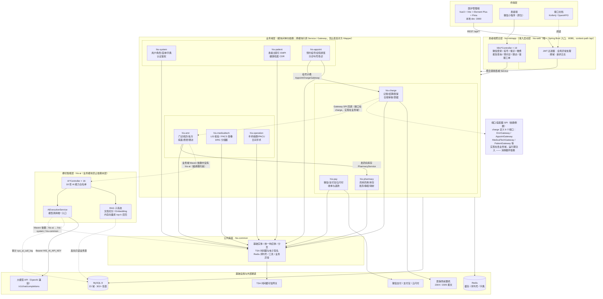
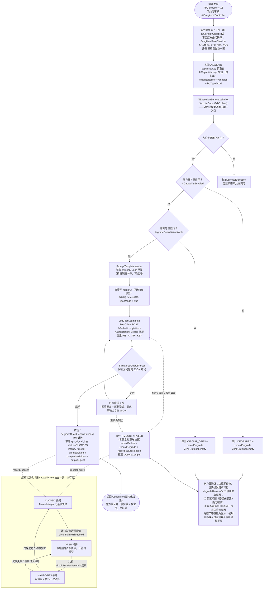
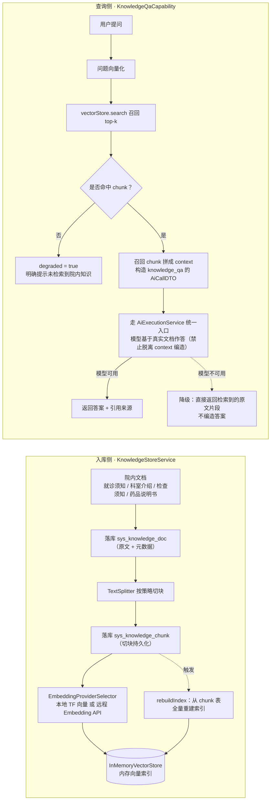
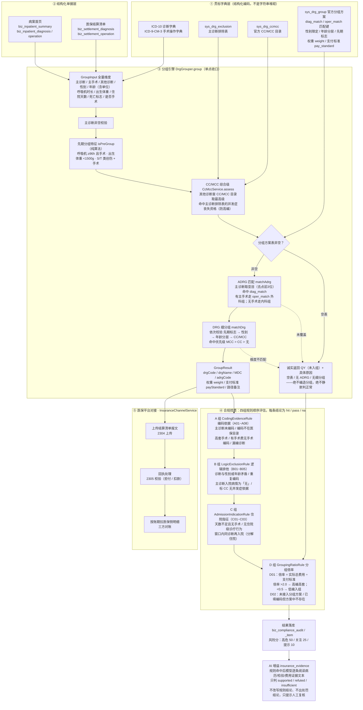
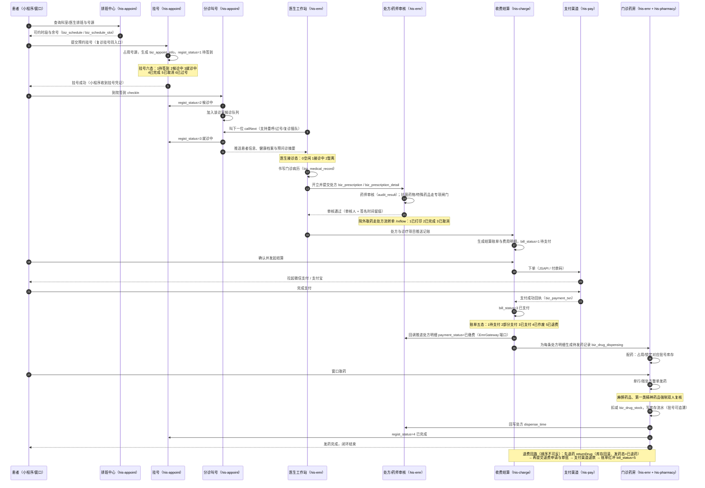

# 面试架构图 · cslk-HIS 三甲医院信息化系统

> 用法：图 1 作为项目总览（讲 2~3 分钟建立全局），图 2/3/4 是三个重点深挖链路（每个讲 3~5 分钟）。
> 图中类名、表名、状态码均与源码一致，面试官指哪都要能展开。

---

## 图 1 · 总体分层架构图

**面试讲解锚点：**

- **模块化单体，不是微服务**：13 个 Maven 模块、单一 Spring Boot 入口；模块边界即未来的拆分边界，哪个域先有压力就按模块拆出去，不需要先上注册中心。
- **两条铁律**：跨模块只允许调对方 Service、禁止直连 Mapper；业务模块编译期不依赖 `his-ai`。
- **依赖倒置消除循环**：收费域要读病历/处方数据，端口接口定义在 `his-charge`，由 `his-emr` 等业务域实现并注入，Maven 依赖始终单向。
- **合规与安全基建内置**：TSA 时间戳 + 电子签名在底座层，支撑病历/处方的法律效力。

---

## 图 2 · AI 能力调用与降级熔断链路（重点）

### 2-A 通用调用链路（所有 18 项能力收口到一个入口）

### 2-B RAG 知识库问答链路（knowledge_qa）

**18 项能力的纪律分层（按"模型能做什么"分组讲）：**

| 类型 | 代表能力 | 模型的角色 | 模型不可用时 |
|---|---|---|---|
| 只做候选、人来终审 | icd10 编码、emr_draft 病历草拟、followup_compose 话术、nursing_handover 交班 | 产出草稿/候选，医生护士编辑终审 | 规则模板拼接，功能不缺位 |
| 只判三态 | insurance_evidence 医保证据 | 只输出 supported / refuted / insufficient，规则结论不可改写 | 规则自身的证据与整改建议照常可见 |
| 事实层代码算，模型只串联 | patient_report_explain、patient_imaging_explain、deterioration_alert | 危急值/评分由代码定，模型只把事实组织成白话（过 PatientTextGuard） | 事实+词典照常返回，白话缺位但绝不编造 |
| 受控例外 | operation_qa（NL2SQL） | 只翻译 SELECT，必须过 OperationSqlGuard 白名单闸门才执行 | 不执行，提示改用固定报表 |
| 非 LLM 通道 | voice_transcribe（ASR） | 音频→文本的确定性转换，不走执行器、独立审计 | 如实报错，禁止造文本 |

**面试讲解锚点：**

- **防幻觉是架构级的，不是靠提示词**：事实层全部代码计算，模型只能解释/判三态/出候选；规则码、枚举值越界一律丢弃。
- **降级必须"可用 + 可见"**：返回空不是终点，能力层用硬规则/词典/模板兜底，并且把"密钥没配/熔断/连接被拒"等真实原因透传给用户。
- **熔断按能力独立**：一个能力挂了不连累其他能力；半开试探避免雪崩后永久降级。
- **审计闭环**：每次调用落 `sys_ai_call_log`，含输入输出摘要、token、延迟、提示词版本；密钥只走环境变量，不落盘不入库。

---

## 图 3 · DRG/DIP 分组引擎与医保合规链路（重点）

**面试讲解锚点：**

- **五层管线**：贯标字典 → 结构化单据 → 分组引擎 → 合规控费 → 医保平台对接；每层产物都是下一层的输入。
- **分组器是真实流程骨架**：先期分组 → ADRG → DRG 细分组，CC/MCC 判定带排除表；不是 if-else 拼字符串。
- **诚实闸门是核心设计**：官方方案、CC/MCC 目录、排除表三样数据缺失时，分组器返回 QY、D 组规则返回 NA 并写明原因，系统绝不伪造"已入组/正常"。
- **数据驱动，无需改码**：医保局数据包一旦灌入三张方案表，分组器与 D 组规则自动生效。
- **AI 只做证据增益**：规则命中在前、模型读证据判三态在后，规则码对齐、结论不落库，防止模型幻觉污染合规结论。
- **可追问的点**：`his-charge` 也有支付域（微信/支付宝在 `his-pay`），收单与医保结算分离；M9 Mock 口子是预留的医保前置机替换点。

---

## 图 4 · 门诊业务闭环时序图（重点）

**面试讲解锚点：**

- **一条状态主线串九个服务**：`regist_status`（1→2→3→4）是患者就诊主轴；`bill_status`、`payment_status`、发药三态是各自域内的支线，状态全部由后端推进、前端只读。
- **缴费是发药的触发器**：支付成功回调 → 处方明细推进 → 生成待发药记录；没有缴费记录就没有发药任务，杜绝漏费发药。
- **跨域调用走端口**：收费回调病历域用 `EmrGateway`（接口在 charge、实现在 emr），发药扣库存调 `PharmacyService`，方向单一、无循环依赖。
- **合规细节有真实业务含量**：麻精一双人复核、抗菌药物专项审核、批号追溯、院外处方流转单，都是可以展开讲的业务规则。
- **三端协同**：小程序经 `his-miniapp` BFF 聚合（挂号/候诊/支付/报告），管理端走 `his-web`，两端共用同一套业务域 Service 与数据。
